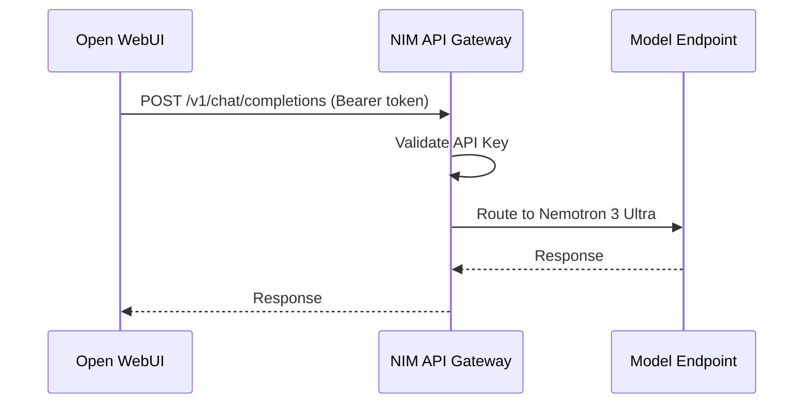
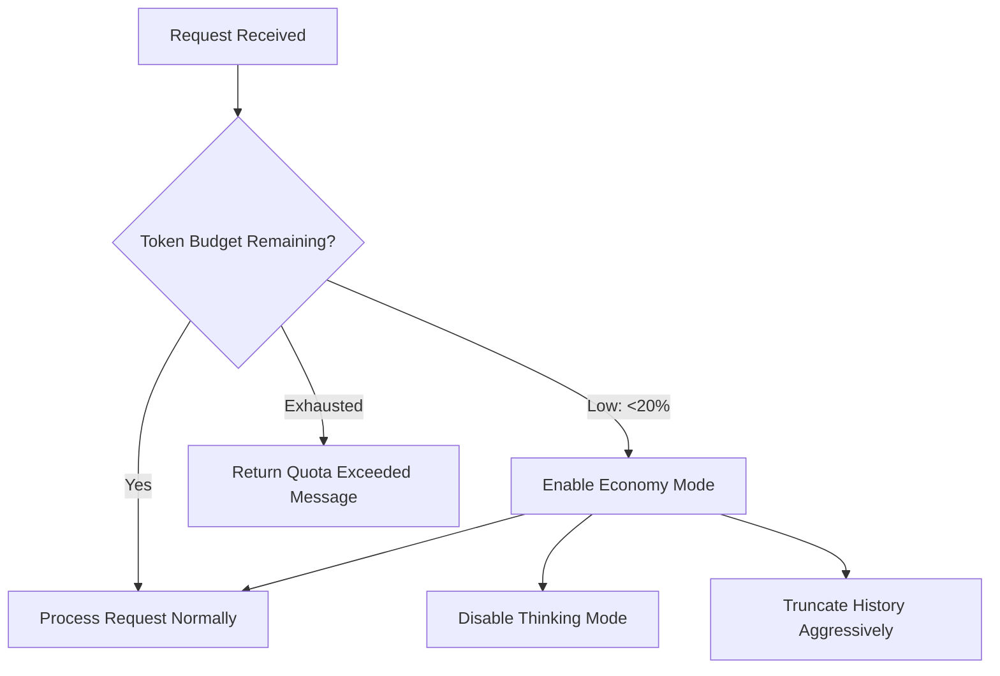
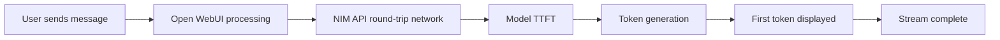
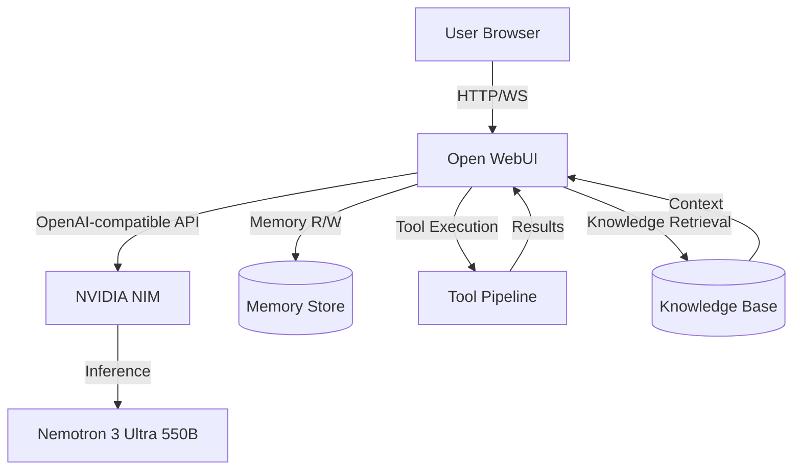
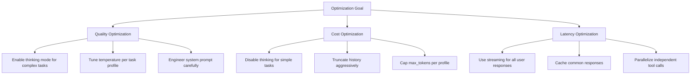
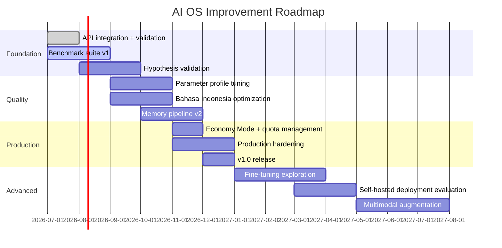

# AI-0001 Part 2: Sections 16–30

> This file is Part 2 of AI-0001. Read together with `AI-0001-Nemotron-Engineering-Spec.md`.

---

## 16. API Constraints

### Purpose

Document all known API-level constraints that engineering implementations must respect when integrating with NVIDIA NIM.

### Explanation

The NVIDIA NIM API follows the **OpenAI Chat Completions API specification** `[NVIDIA-NIM-DOCS: R3]`. All requests are made to the NIM endpoint using standard HTTP with Bearer token authentication. The API is **stateless** — no session or conversation state is persisted server-side.

### API Endpoint

```
POST https://integrate.api.nvidia.com/v1/chat/completions
Authorization: Bearer {NVIDIA_API_KEY}
Content-Type: application/json
```

`[NVIDIA-NIM-DOCS: R3]`

### Supported API Parameters

| Parameter | Type | Description | Notes |
|-----------|------|-------------|-------|
| `model` | string | Model identifier | `nvidia/nemotron-3-ultra-550b-a55b` |
| `messages` | array | Conversation history | Required |
| `max_tokens` | integer | Max output tokens | Hard cap: 16,384 |
| `temperature` | float | Randomness (0.0–2.0) | |
| `top_p` | float | Nucleus sampling | |
| `top_k` | integer | Top-K sampling | |
| `stream` | boolean | Enable SSE streaming | |
| `stop` | string/array | Stop sequences | |
| `tools` | array | Function definitions | OpenAI schema |
| `tool_choice` | string/object | Tool selection mode | |
| `thinking` | object | CoT thinking mode | `{"type": "enabled"}` |

`[NVIDIA-NIM-DOCS: R3][PROVIDER-VERIFIED: R5][R6]`

### API Authentication



### API Key Management Rules

1. NVIDIA API key must be stored in Open WebUI environment variables — **never hardcoded**
2. Rotate keys according to the schedule defined in `docs/10_CONFIGURATION/Parameters.md`
3. Use separate API keys for development and production environments
4. Monitor API key usage via NVIDIA Build dashboard for quota tracking

### Error Codes

| HTTP Status | Meaning | Engineering Action |
|-------------|---------|--------------------|
| 200 | Success | Process response |
| 400 | Bad Request (malformed JSON) | Validate request schema |
| 401 | Unauthorized (invalid/expired key) | Rotate API key |
| 429 | Rate limit exceeded | Implement exponential backoff |
| 500 | Server error | Retry with backoff; log incident |
| 503 | Service unavailable | Retry; check NIM status page |

### Best Practice

- Implement retry logic with exponential backoff for 429 and 5xx errors
- Always validate `finish_reason` in the response (`stop`, `tool_calls`, `length`)
- Use streaming for responses > 500 tokens to improve perceived latency
- Set a client-side timeout of 120 seconds for non-streaming requests

### Risk

| Risk | Severity | Mitigation |
|------|----------|------------|
| API key exposure | Critical | Use environment variables, audit logs |
| Rate limit causes user-facing failures | High | Implement request queue + graceful degradation |
| API schema changes break integration | Medium | Pin to versioned endpoint when available |

---

## 17. Free Tier Constraints

### Purpose

Document the specific constraints of the NVIDIA NIM free tier that affect AI OS development and operational planning.

### Explanation

NVIDIA Build provides free API access to Nemotron 3 Ultra 550B `[NVIDIA-BUILD: R2]`. This free tier is quota-limited. The exact quota values are managed via the NVIDIA Build dashboard and may change without public announcement.

### Free Tier Engineering Rules

> **WARNING:** Free tier quotas are not published in static documentation. Always verify current limits from the NVIDIA Build dashboard. The values below are engineering targets, not guaranteed limits.

| Constraint | Known/Estimated | Action Required |
|------------|----------------|------------------|
| Daily token quota | Verify on dashboard | Monitor daily usage |
| Rate limit (requests/min) | Verify on dashboard | Implement request throttling |
| Max concurrent requests | Verify on dashboard | Queue concurrent requests |
| Context window on free tier | Same as paid (1M) | No constraint `[PROVIDER-VERIFIED: R4]` |
| Max output tokens on free tier | Same as paid (16,384) | No constraint `[PROVIDER-VERIFIED: R6]` |

### Token Budget Strategy

For free tier operation, the AI OS must implement a **daily token budget** with usage tracking:



### Economy Mode Parameters

When token budget is low, switch to Economy Mode:

| Parameter | Normal Mode | Economy Mode |
|-----------|-------------|-------------|
| `max_tokens` | 4096 | 1024 |
| `thinking` | enabled (complex tasks) | disabled |
| History turns injected | All (up to 100K) | Last 5 turns only |
| Memory entries injected | 10 | 3 |
| Tool calls per request | Up to 5 | 1 |

### Best Practice

- Implement per-session and per-day token counters in Open WebUI
- Log all requests with token counts to enable usage analysis
- Build a cost simulation tool using `docs/40_FINETUNE/` benchmark data
- For production, budget to migrate to paid tier at defined usage thresholds

### Risk

| Risk | Severity | Mitigation |
|------|----------|------------|
| Quota exhaustion mid-session | High | Implement proactive budget warnings |
| Undocumented quota reductions by NVIDIA | Medium | Monitor dashboard weekly; build alerting |
| Free tier discontinuation | Low | Budget for paid tier migration |

---

## 18. Performance Characteristics

### Purpose

Document the known and expected performance characteristics of Nemotron 3 Ultra 550B on NVIDIA NIM.

### Explanation

Nemotron 3 Ultra 550B achieves high inference efficiency relative to its parameter count due to its MoE architecture, where only 55B parameters are active per forward pass `[NVIDIA-OFFICIAL: R1]`. The model is reported to have a **1.71x speedup vs Llama-3.1-405B-Instruct** based on the FFN Fusion technique applied to the 253B predecessor `[NVIDIA-OFFICIAL: R7]`.

> **HYPOTHESIS H-010:** The inference speedup figures from the 253B model paper may not directly translate to the 550B MoE model. Validate inference throughput empirically via the benchmark suite.

### Benchmark Context

The following benchmarks are referenced from NVIDIA's public documentation `[NVIDIA-OFFICIAL: R1][NVIDIA-BUILD: R2]`:

| Benchmark | Category | Relative Performance |
|-----------|----------|----------------------|
| MATH-500 | Math Reasoning | Strong (frontier class) |
| HumanEval | Code Generation | Strong |
| MMLU | Knowledge/Reasoning | Strong |
| LiveBench | Multi-domain | Competitive |

> **Engineering Note:** NVIDIA describes the model as achieving "highest accuracy for scientific and complex math reasoning, coding, tool calling, and instruction following" `[NVIDIA-BUILD: R2]`. These are superlatives that require validation against the specific use cases of the AI OS.

### Throughput Characteristics

| Metric | Expected Range | Evidence |
|--------|---------------|----------|
| Time to first token (TTFT) | 1–5 seconds | `[HYPOTHESIS: H-011]` |
| Tokens per second (TPS) | 20–100 TPS | `[HYPOTHESIS: H-011]` |
| Full response (1024 tokens) | 15–60 seconds | `[HYPOTHESIS: H-011]` |
| Thinking mode overhead | +5–30 seconds | `[HYPOTHESIS: H-011]` |

> **HYPOTHESIS H-011:** All throughput estimates above are engineering hypotheses based on typical NIM-hosted 50B-class MoE inference benchmarks. **Must be measured empirically** against the live NIM endpoint before establishing SLAs.

---

## 19. Latency Characteristics

### Purpose

Define latency targets and measurement methodology for the AI OS production deployment.

### Latency Components



| Component | Estimated Contribution | Controllable? |
|-----------|----------------------|---------------|
| Open WebUI processing | < 100ms | ✅ Yes |
| Network latency to NIM | 50–200ms | Partial (region) |
| Time to First Token (TTFT) | 1,000–5,000ms | ❌ No (model) |
| Token generation (per token) | 10–50ms | ❌ No (model) |

### Latency SLA Targets (Engineering Targets)

| Percentile | Target Latency | Mode |
|------------|---------------|------|
| p50 (median) | < 8 seconds (full response) | Standard |
| p95 | < 30 seconds | Standard |
| p50 (thinking mode) | < 20 seconds | Thinking |
| p95 (thinking mode) | < 60 seconds | Thinking |

> **WARNING:** These targets are `[HYPOTHESIS: H-012]` and must be validated empirically before being committed as production SLAs.

### Mitigation for High Latency

1. **Streaming is mandatory** for all responses to eliminate perceived full-response wait time
2. Show typing indicator immediately upon request submission
3. Display partial thinking progress if thinking mode is enabled
4. Implement client-side timeout with graceful retry for responses > 120 seconds

---

## 20. Token Behaviour

### Purpose

Document the tokenization characteristics and token budget engineering rules.

### Tokenizer

> **HYPOTHESIS H-013:** Nemotron 3 Ultra 550B likely uses a BPE tokenizer compatible with the Llama 3.1 tokenizer family, given its lineage from Llama-3.1-405B `[NVIDIA-OFFICIAL: R7]`. Validate token counts against the NIM API before assuming compatibility.

### Token Budget Engineering Rules

| Budget Item | Token Allocation | Notes |
|-------------|-----------------|-------|
| System prompt | ≤ 500 tokens | Keep concise |
| Injected memories | ≤ 500 tokens | 10 entries × 50 tokens each |
| RAG / knowledge context | ≤ 50,000 tokens | Adjust based on task |
| Conversation history | ≤ 100,000 tokens | Truncate older turns |
| Current user message | ≤ 2,000 tokens | Warning if exceeded |
| Reserved output buffer | 4,096–16,384 tokens | Set via `max_tokens` |
| Safety buffer | 10% of window | Never fill to 100% |

### Token Counting Rule

```
Request Token Count = len(tokenize(system + memories + history + current_message))
Output Token Count = len(tokenize(response))
Total Billed = Request Tokens + Output Tokens
```

### Best Practice

- Always calculate estimated token count before sending request
- Use the NIM API `usage` field in responses to track exact consumed tokens
- Log `prompt_tokens`, `completion_tokens`, `total_tokens` from every API response for quota monitoring

---

## 21. Thinking Behaviour

### Purpose

Document the chain-of-thought thinking mode and when to enable/disable it in the AI OS.

### Explanation

Nemotron 3 Ultra 550B supports an explicit **thinking mode** `[PROVIDER-VERIFIED: R5][R6]` where the model generates an internal reasoning scratchpad before producing the final answer. This is similar to "extended thinking" in other frontier models.

### Thinking Mode API Parameter

```json
{
  "thinking": {"type": "enabled"}   // Enable thinking
  "thinking": {"type": "disabled"}  // Disable thinking
}
```

### Thinking Mode Decision Matrix

| Task Type | Use Thinking? | Rationale |
|-----------|--------------|----------|
| Simple factual Q&A | ❌ No | Unnecessary token cost |
| Casual conversation | ❌ No | Latency too high for chat |
| Complex reasoning | ✅ Yes | Core purpose of thinking mode |
| Multi-step planning | ✅ Yes | Planning quality significantly higher |
| Code generation (simple) | ❌ No | Direct generation sufficient |
| Code generation (complex algorithm) | ✅ Yes | Design quality improvement |
| Mathematical computation | ✅ Yes | Accuracy improvement |
| Creative writing | ❌ No | Token overhead not justified |
| Tool call decisions | ⚠️ Optional | Use for ambiguous tool selection |

### Thinking Token Overhead Estimate

> **HYPOTHESIS H-014:** Thinking scratchpad for a typical planning task may generate 500–2000 additional tokens of reasoning content. This is not billed separately in all providers but does consume context window space. Validate with empirical measurement.

### Best Practice

- Expose thinking mode as a user-configurable toggle in Open WebUI
- Default: **disabled** for conversation; **enabled** for Planner/Critic components
- Monitor and log thinking scratchpad token consumption per session

---

## 22. Streaming Behaviour

### Purpose

Document the SSE streaming behaviour for UI integration in Open WebUI.

### Explanation

NVIDIA NIM supports **Server-Sent Events (SSE) streaming** `[NVIDIA-NIM-DOCS: R3]`, identical to the OpenAI streaming protocol. When `stream: true`, the API returns incremental token chunks as `data: {...}` events, terminated by `data: [DONE]`.

### Streaming Request

```json
{
  "model": "nvidia/nemotron-3-ultra-550b-a55b",
  "messages": [...],
  "stream": true,
  "max_tokens": 4096
}
```

### Streaming Response Format

```
data: {"choices":[{"delta":{"content":"Hello"},"finish_reason":null}]}
data: {"choices":[{"delta":{"content":" world"},"finish_reason":null}]}
data: {"choices":[{"delta":{"content":""},"finish_reason":"stop"}]}
data: [DONE]
```

`[NVIDIA-NIM-DOCS: R3]`

### Streaming Engineering Rules

1. **Always use streaming** for all user-facing requests to avoid perceived latency
2. Handle `finish_reason: "length"` — indicates output was truncated at `max_tokens`
3. Handle `finish_reason: "tool_calls"` — requires tool invocation before continuation
4. Implement stream reconnection on network interruption
5. Open WebUI handles SSE streaming natively; no custom implementation required

### Best Practice

- Disable streaming for internal pipeline calls (e.g., memory extraction) where you need the full response atomically
- Enable streaming for all user-visible responses
- Log `finish_reason` for every request to detect truncation events

---

## 23. Parameter Behaviour

### Purpose

Document the behaviour of each API parameter and provide engineering-validated settings for AI OS profiles.

### Parameter Reference

| Parameter | Range | Default | Effect |
|-----------|-------|---------|--------|
| `temperature` | 0.0–2.0 | 1.0 | Higher = more random; lower = more deterministic |
| `top_p` | 0.0–1.0 | 1.0 | Nucleus sampling cutoff |
| `top_k` | 1–∞ | 0 (disabled) | Limit token selection pool |
| `max_tokens` | 1–16,384 | Model default | Hard cap on output length |
| `stream` | bool | false | Enable SSE streaming |
| `stop` | string/array | null | Early termination sequences |
| `frequency_penalty` | -2.0–2.0 | 0.0 | Reduce token repetition |
| `presence_penalty` | -2.0–2.0 | 0.0 | Encourage topic diversity |

`[NVIDIA-NIM-DOCS: R3]`

### Recommended Profiles

#### Profile A — Conversation (Default)

```json
{
  "temperature": 0.6,
  "top_p": 0.9,
  "max_tokens": 2048,
  "stream": true,
  "thinking": {"type": "disabled"}
}
```

#### Profile B — Deep Reasoning

```json
{
  "temperature": 0.3,
  "top_p": 0.85,
  "max_tokens": 8192,
  "stream": true,
  "thinking": {"type": "enabled"}
}
```

#### Profile C — Code Generation

```json
{
  "temperature": 0.2,
  "top_p": 0.85,
  "max_tokens": 4096,
  "stream": true,
  "thinking": {"type": "enabled"}
}
```

#### Profile D — Economy Mode

```json
{
  "temperature": 0.5,
  "top_p": 0.9,
  "max_tokens": 1024,
  "stream": true,
  "thinking": {"type": "disabled"}
}
```

> These profiles are `[HYPOTHESIS: H-015]` — initial engineering estimates. Validate and tune with the benchmark suite before production deployment.

---

## 24. OpenWebUI Integration

### Purpose

Document the integration architecture between Open WebUI and NVIDIA NIM for Nemotron 3 Ultra 550B.

### Integration Architecture



### Configuration in Open WebUI

| Setting | Value | Location |
|---------|-------|----------|
| API Base URL | `https://integrate.api.nvidia.com/v1` | Admin → Connections |
| Model ID | `nvidia/nemotron-3-ultra-550b-a55b` | Model config |
| API Key | `$NVIDIA_API_KEY` (env var) | Admin → Connections |
| Streaming | Enabled | Model config |
| Max Tokens | 4096 (default profile) | Model config |

### OpenWebUI Feature Compatibility

| Feature | Compatible? | Notes |
|---------|-------------|-------|
| Chat interface | ✅ Yes | Full support |
| Streaming responses | ✅ Yes | Native SSE |
| System prompt editor | ✅ Yes | Use for AI OS persona |
| Tool/function calling | ✅ Yes | OpenAI schema compatible |
| Knowledge base (RAG) | ✅ Yes | Context injection |
| Memory (persistent) | ✅ Yes | Via Open WebUI memory layer |
| Model parameters UI | ✅ Yes | temperature, top_p, max_tokens |
| Multi-model routing | ✅ Yes | For model fallback |
| Code execution sandbox | ✅ Yes | For code output validation |
| Voice input | ⚠️ N/A | Model is text-only |
| Image input | ❌ No | Model is text-only |

### Best Practice

- Store the NIM API key exclusively in Open WebUI environment variable `OPENAI_API_KEY`
- Use Open WebUI's native memory system as the primary memory layer
- Configure model parameters at the model level (not per-chat) for consistency
- Use Open WebUI workspace to separate AI OS persona from casual use

---

## 25. Optimization Guidelines

### Purpose

Provide actionable optimization strategies for performance, cost, and quality in the AI OS.

### Optimization Hierarchy



### Prompt Optimization

| Technique | Effect | Trade-off |
|-----------|--------|----------|
| Few-shot examples in system prompt | Higher instruction compliance | +Token cost |
| Explicit output format instructions | Structured, parseable output | Slight rigidity |
| Thinking mode for hard tasks | Higher reasoning quality | +Latency, +tokens |
| Shorter system prompts | Lower token cost | Less control |
| Role-based persona | Consistent behaviour | Minor overhead |

### Context Optimization

- Compress conversation history by summarizing turns older than 20
- Use semantic similarity to select the most relevant memory entries
- Inject knowledge base chunks at the end of context (recency effect)
- Remove redundant whitespace and formatting from injected documents to save tokens

---

## 26. Design Principles

### Purpose

Define the engineering design principles governing how the AI OS uses Nemotron 3 Ultra 550B.

### Core Principles

#### Principle 1: Evidence Over Assumption

Every capability claim about the model must be backed by documented evidence or clearly marked as a hypothesis. Never build production features on assumed capabilities.

#### Principle 2: Token Economy

Token usage is finite (free tier) and costly (paid tier). Every engineering decision must consider token efficiency. Expensive features (thinking mode, large context) must be justified by quality improvement.

#### Principle 3: Graceful Degradation

The AI OS must continue to function at reduced capability when:
- Quota is exhausted (Economy Mode)
- API is unavailable (fallback message)
- Latency exceeds threshold (timeout handling)

#### Principle 4: Stateless API, Stateful Experience

The NIM API is stateless. The AI OS must maintain all state (conversation history, memory, context) externally and inject it reliably. User experience must feel stateful even though the underlying API is not.

#### Principle 5: Fail Loudly in Development, Fail Gracefully in Production

During development: log every error, every token count, every parameter setting. In production: present user-friendly messages; hide technical details.

#### Principle 6: Validate Everything

All hypotheses in this document must be converted to validated facts via the benchmark suite before features depending on them are deployed to production.

---

## 27. Engineering Recommendations

### Purpose

Provide concrete, prioritized engineering recommendations for building the AI OS on Nemotron 3 Ultra 550B.

### Priority 1: Foundation (Must Do Before v0.1)

- [ ] Validate NIM API connectivity and authentication
- [ ] Confirm exact API parameters supported for `nvidia/nemotron-3-ultra-550b-a55b`
- [ ] Establish token counting pipeline
- [ ] Test streaming behaviour in Open WebUI
- [ ] Validate function calling schema end-to-end

### Priority 2: Quality Baseline (Must Do Before v0.2)

- [ ] Run benchmark suite for reasoning quality (see `AI-0004-Benchmark.md`)
- [ ] Benchmark Bahasa Indonesia quality (H-001)
- [ ] Measure actual TTFT and TPS from NIM (H-011, H-012)
- [ ] Test thinking mode token consumption (H-014)
- [ ] Validate reproducibility at temperature=0 (H-003)

### Priority 3: Production Hardening (Must Do Before v1.0)

- [ ] Implement request retry with exponential backoff
- [ ] Implement token budget monitoring and Economy Mode
- [ ] Implement conversation history truncation and summarization
- [ ] Implement memory retrieval and injection pipeline
- [ ] Load test at 10 concurrent users

### Priority 4: Optimization (v1.0+)

- [ ] Profile per-task parameter tuning
- [ ] Implement semantic caching for repeated queries
- [ ] Evaluate migration to self-hosted deployment
- [ ] Evaluate fine-tuning on domain-specific data (see `docs/40_FINETUNE/`)

---

## 28. Production Best Practices

### Purpose

Document production readiness requirements before the AI OS is deployed to real users.

### Readiness Checklist

```
[ ] API key stored securely (environment variable, not hardcoded)
[ ] Request logging enabled (request ID, token count, latency, finish_reason)
[ ] Error handling implemented (retry, fallback, user-friendly messages)
[ ] Rate limit handling implemented (queue, backoff, graceful degradation)
[ ] Context size monitoring active (alert at 70% fill)
[ ] Token budget monitoring active (daily counter, alert at 80%)
[ ] Streaming enabled for all user-facing responses
[ ] Thinking mode enabled only for qualifying task types
[ ] System prompt validated against all capability hypotheses
[ ] Benchmark suite results documented in AI-0004
[ ] Bahasa Indonesia quality validated (H-001)
[ ] Latency SLAs confirmed empirically (H-011, H-012)
```

### Monitoring Metrics

| Metric | Alert Threshold | Action |
|--------|----------------|--------|
| Daily token usage | > 80% of quota | Switch to Economy Mode |
| Request error rate | > 5% | Investigate; alert on-call |
| p95 latency | > 60 seconds | Check NIM status |
| Context fill % | > 70% | Trigger summarization |
| `finish_reason: "length"` rate | > 10% | Increase `max_tokens` |

---

## 29. Anti-Patterns

### Purpose

Document known anti-patterns that will cause quality degradation, token waste, or production failures.

### Anti-Pattern Catalogue

#### AP-001: Enabling Thinking Mode for All Requests

```
❌ WRONG: Always set thinking: enabled
✅ RIGHT: Enable thinking only for complex reasoning, planning, and math tasks
Impact: 3-10x token waste, 3-5x latency increase for simple queries
```

#### AP-002: Injecting Full Conversation History Without Truncation

```
❌ WRONG: Send all 500 conversation turns in every request
✅ RIGHT: Summarize turns older than 20; keep last 20 turns verbatim
Impact: Context window exhaustion, quota depletion, degraded model attention
```

#### AP-003: Using Vague Tool Descriptions

```
❌ WRONG: {"description": "Get information"}
✅ RIGHT: {"description": "Search the web for current factual information about a topic"}
Impact: Model calls wrong tool or fails to call tool when needed
```

#### AP-004: Not Validating finish_reason

```
❌ WRONG: Display response content without checking finish_reason
✅ RIGHT: Check finish_reason; handle "length" (truncation) and "tool_calls" explicitly
Impact: Silently truncated responses; missed tool call opportunities
```

#### AP-005: Hardcoding API Keys

```
❌ WRONG: api_key = "nvapi-xxxxxxxxx" in source code
✅ RIGHT: api_key = os.environ["NVIDIA_API_KEY"]
Impact: Security breach; key exposure in version control
```

#### AP-006: Building Features on Unvalidated Hypotheses

```
❌ WRONG: Deploy Bahasa Indonesia feature before testing H-001
✅ RIGHT: Validate H-001 in benchmark suite; then build
Impact: Poor user experience; incorrect quality expectations
```

#### AP-007: No Retry Logic

```
❌ WRONG: Single API call; fail immediately on error
✅ RIGHT: Implement 3-attempt exponential backoff for 429/5xx errors
Impact: Unnecessary user-facing failures for transient API issues
```

#### AP-008: Ignoring Token Counts in Responses

```
❌ WRONG: Ignore the usage field in API responses
✅ RIGHT: Log usage.prompt_tokens, usage.completion_tokens per request
Impact: Invisible quota depletion; no data for optimization
```

---

## 30. Future Improvement Strategy

### Purpose

Define the roadmap for improving the AI OS's use of Nemotron 3 Ultra 550B over time.

### Improvement Roadmap



### Model Upgrade Strategy

When a newer model becomes available (Nemotron 4 or successor):

1. Create new engineering spec document (AI-0007 or similar)
2. Run side-by-side benchmarks with current benchmark suite
3. Validate all capability claims against new model
4. Update parameter profiles if API parameters differ
5. Update Open WebUI model ID
6. Maintain this document as historical reference

### Fine-Tuning Strategy

Fine-tuning on domain-specific data may improve AI OS quality for:

| Domain | Expected Benefit | Priority |
|--------|-----------------|----------|
| Bahasa Indonesia instruction following | High | v1.x |
| AI OS-specific knowledge | Medium | v1.x |
| Tool calling schemas for AI OS tools | Medium | v2.x |
| User preference alignment | Low (handled by RL) | v2.x |

> See `docs/40_FINETUNE/README.md` for the fine-tuning implementation plan.

### Open Hypotheses Tracker

| ID | Hypothesis | Priority | Target Sprint |
|----|-----------|----------|---------------|
| H-001 | Bahasa Indonesia quality | Critical | Sprint 0.2 |
| H-002 | Training data cutoff | Medium | Sprint 0.2 |
| H-003 | MoE temperature=0 reproducibility | High | Sprint 0.2 |
| H-004 | Hybrid Mamba architecture | Low | Sprint 0.3 |
| H-005 | Counterfactual/analogical reasoning | Medium | Sprint 0.3 |
| H-006 | Mid-conversation language switching | Medium | Sprint 0.2 |
| H-007 | SQL and Bash support | Medium | Sprint 0.2 |
| H-008 | Lost-in-the-middle degradation | High | Sprint 0.2 |
| H-009 | Thinking mode latency | High | Sprint 0.1 |
| H-010 | 550B vs 253B speedup applicability | High | Sprint 0.2 |
| H-011 | TTFT and TPS from NIM | Critical | Sprint 0.1 |
| H-012 | Latency SLAs | Critical | Sprint 0.1 |
| H-013 | Tokenizer compatibility | High | Sprint 0.1 |
| H-014 | Thinking token overhead | High | Sprint 0.1 |
| H-015 | Parameter profile quality | High | Sprint 0.2 |

---

## Document Revision History

| Version | Date | Author | Changes |
|---------|------|--------|---------|
| 0.1.0 | 2026-07-20 | Aldhie | Initial template |
| 0.2.0 | 2026-07-20 | Aldhie | Full production engineering spec (30 sections) |

---

## TODO (Pending Validation)

- [ ] Validate all 15 engineering hypotheses via benchmark suite (see `docs/90_TESTING/BenchmarkCases.md`)
- [ ] Measure empirical latency from live NIM endpoint
- [ ] Confirm training data cutoff date
- [ ] Test Bahasa Indonesia quality
- [ ] Confirm exact free tier quota limits from NVIDIA Build dashboard
- [ ] Validate function calling schema with live NIM endpoint
- [ ] Test thinking mode token consumption empirically
- [ ] Validate parameter profiles against benchmark cases
