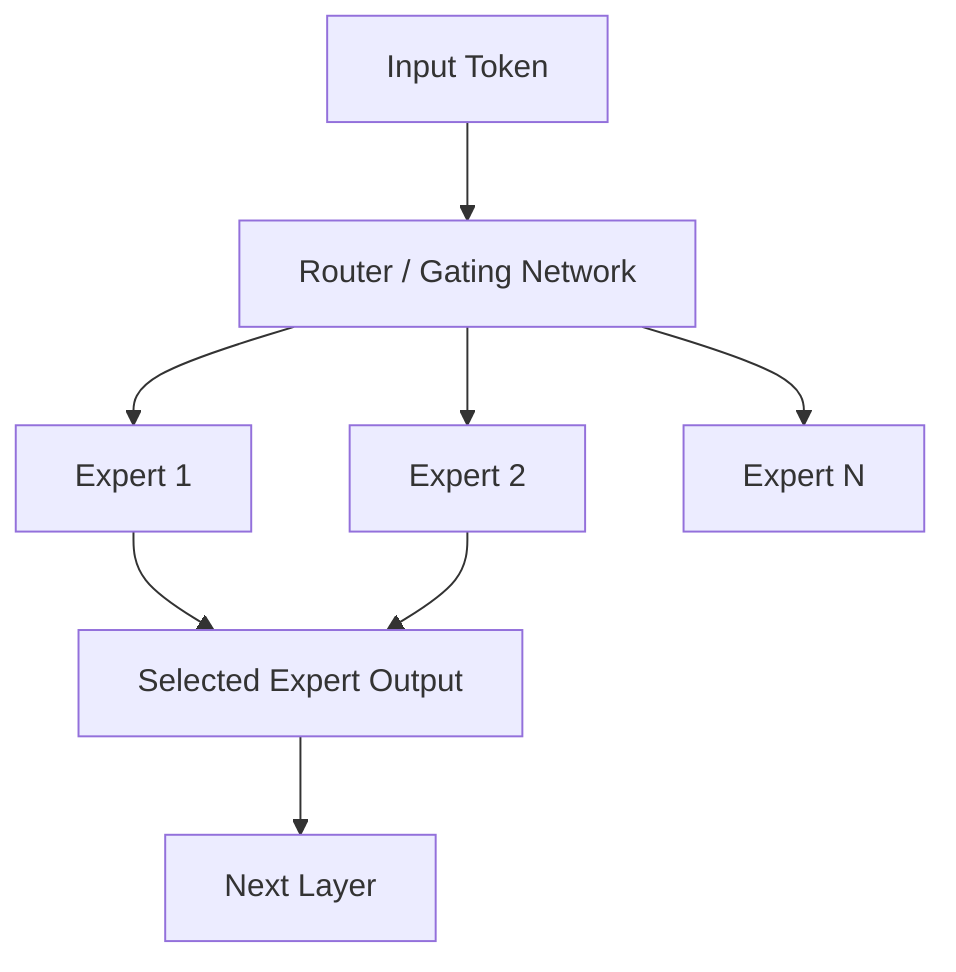
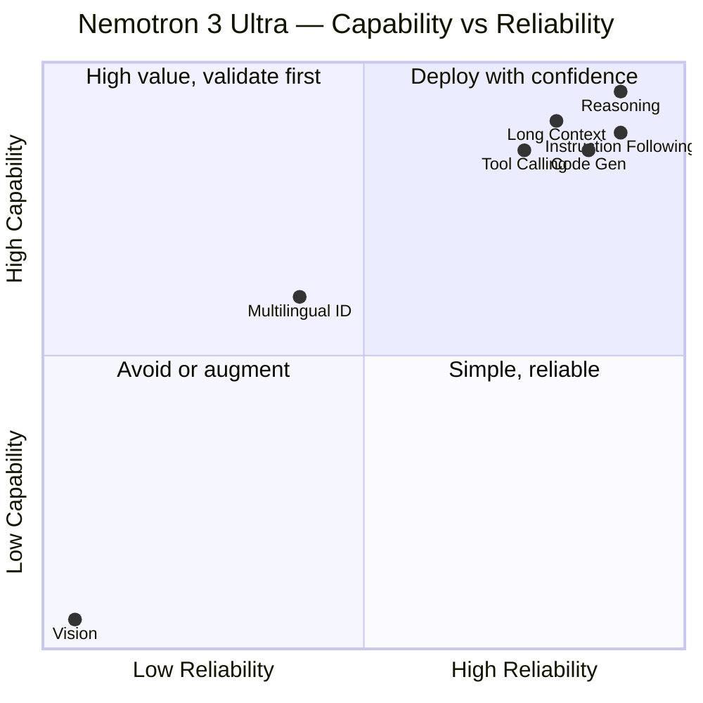
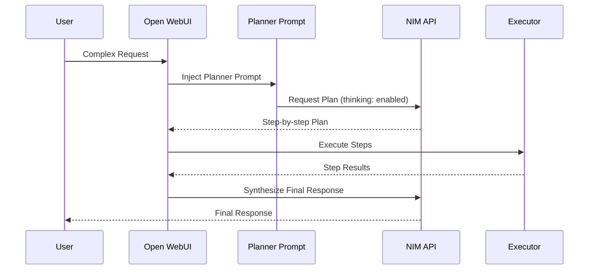
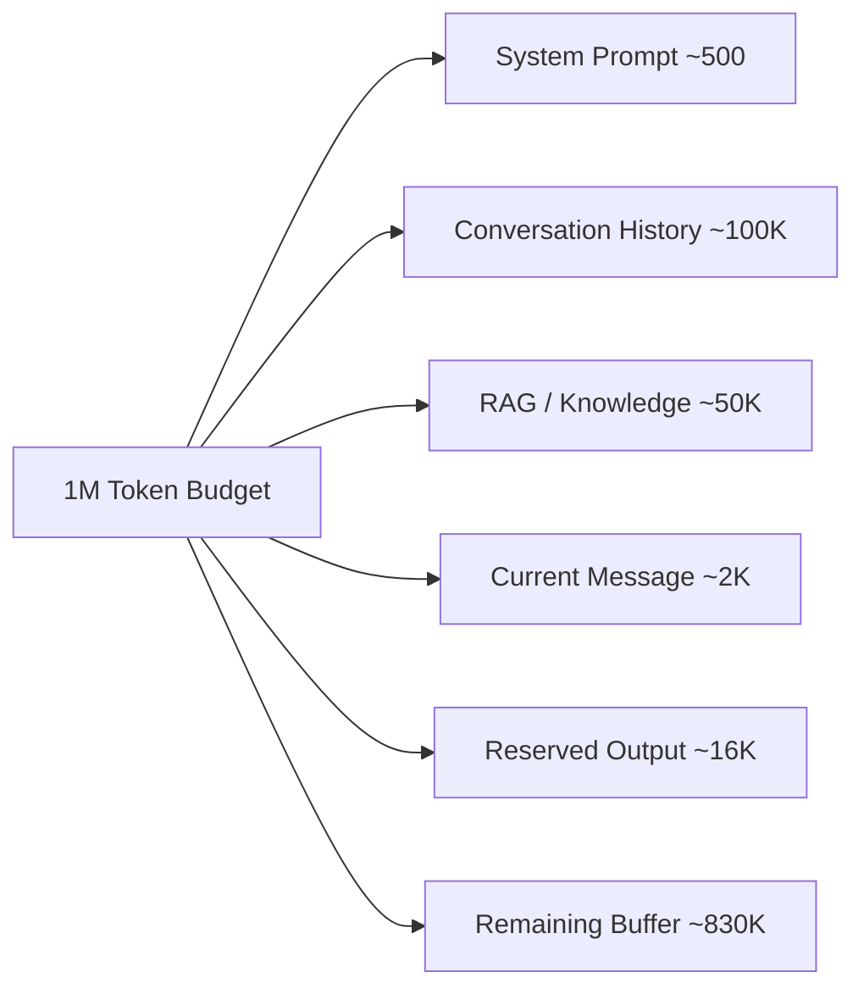
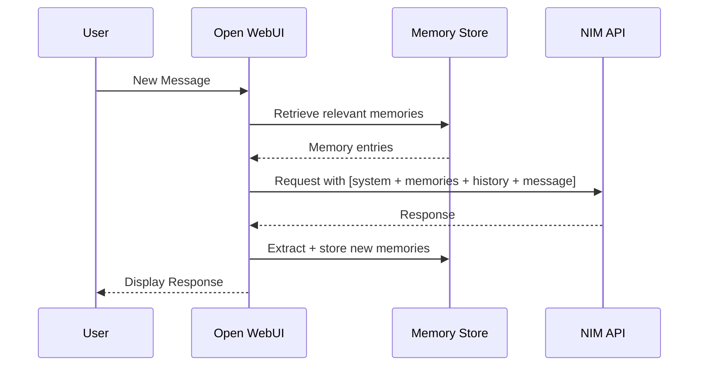

# AI-0001: Nemotron 3 Ultra 550B — Engineering Specification

---

## Document Metadata

| Field | Value |
|-------|-------|
| **Document ID** | AI-0001 |
| **Title** | Nemotron 3 Ultra 550B Engineering Specification |
| **Version** | 0.2.0 |
| **Status** | Active |
| **Owner** | Aldhie |
| **Created** | 2026-07-20 |
| **Updated** | 2026-07-20 |
| **Sprint** | Sprint 0.1 |

---

## Evidence Standard

Every factual claim in this document is backed by one of the following evidence tiers:

| Tier | Label | Meaning |
|------|-------|---------|
| T1 | `[NVIDIA-OFFICIAL]` | NVIDIA official blog, documentation, or model card |
| T2 | `[NVIDIA-NIM-DOCS]` | NVIDIA NIM API reference documentation |
| T3 | `[NVIDIA-BUILD]` | NVIDIA Build platform (`build.nvidia.com`) |
| T4 | `[PROVIDER-VERIFIED]` | Third-party API provider (Together.ai, OpenRouter) publishing verified specs |
| T5 | `[HYPOTHESIS]` | Engineering hypothesis — must be validated before production use |

> **WARNING:** Any claim marked `[HYPOTHESIS]` must be treated as unverified. Do not deploy based on hypotheses without empirical validation.

---

## Dependencies

- `AI-0002-NVIDIA-NIM-API.md` — API access layer and authentication
- `AI-0003-OpenWebUI-Compatibility.md` — interface compatibility matrix
- `AI-0004-Benchmark.md` — benchmark strategy and scoring
- `AI-0005-FreeTier-Strategy.md` — quota and cost management
- `docs/10_CONFIGURATION/Parameters.md` — deployed parameter configuration
- `prompts/nemotron-ultra/system.txt` — system prompt implementation

---

## References

| ID | Source | URL |
|----|--------|-----|
| R1 | NVIDIA Developer Blog — Nemotron 3 Ultra Launch | https://developer.nvidia.com/blog/nvidia-nemotron-3-ultra-powers-faster-more-efficient-reasoning-for-long-running-agents/ |
| R2 | NVIDIA Build Platform | https://build.nvidia.com/nvidia/nemotron-3-ultra-550b-a55b |
| R3 | NVIDIA NIM LLM API Reference | https://docs.api.nvidia.com/nim/reference/llm-apis |
| R4 | CloudPrice — Nemotron 3 Ultra Specs | https://cloudprice.net/models/nvidia-nemotron-3-ultra-550b-a55b |
| R5 | Together.ai — Nemotron 3 Ultra | https://www.together.ai/models/nvidia-nemotron-3-ultra |
| R6 | Haimaker.ai — Model Specs | https://haimaker.ai/models/nvidia/nemotron-3-ultra-550b-a55b |
| R7 | FFN Fusion Paper (Ultra-253B basis) | https://arxiv.org/pdf/2503.18908.pdf |
| R8 | NVIDIA NGC NIM Container | https://catalog.ngc.nvidia.com/orgs/nim/teams/nvidia/containers/llama-3.1-nemotron-ultra-253b-v1 |

---

## Table of Contents

1. [Executive Summary](#1-executive-summary)
2. [Model Overview](#2-model-overview)
3. [Architecture Overview](#3-architecture-overview)
4. [Core Capability Matrix](#4-core-capability-matrix)
5. [Reasoning Capability](#5-reasoning-capability)
6. [Conversation Capability](#6-conversation-capability)
7. [Coding Capability](#7-coding-capability)
8. [Planning Capability](#8-planning-capability)
9. [Tool Calling Capability](#9-tool-calling-capability)
10. [Long Context Capability](#10-long-context-capability)
11. [Memory Interaction](#11-memory-interaction)
12. [Instruction Following](#12-instruction-following)
13. [Known Strengths](#13-known-strengths)
14. [Known Weaknesses](#14-known-weaknesses)
15. [Known Limitations](#15-known-limitations)
16. [API Constraints](#16-api-constraints)
17. [Free Tier Constraints](#17-free-tier-constraints)
18. [Performance Characteristics](#18-performance-characteristics)
19. [Latency Characteristics](#19-latency-characteristics)
20. [Token Behaviour](#20-token-behaviour)
21. [Thinking Behaviour](#21-thinking-behaviour)
22. [Streaming Behaviour](#22-streaming-behaviour)
23. [Parameter Behaviour](#23-parameter-behaviour)
24. [OpenWebUI Integration](#24-openwebui-integration)
25. [Optimization Guidelines](#25-optimization-guidelines)
26. [Design Principles](#26-design-principles)
27. [Engineering Recommendations](#27-engineering-recommendations)
28. [Production Best Practices](#28-production-best-practices)
29. [Anti-Patterns](#29-anti-patterns)
30. [Future Improvement Strategy](#30-future-improvement-strategy)

---

## 1. Executive Summary

### Purpose

Provide a concise, decision-maker-level summary of the Nemotron 3 Ultra 550B model, its strategic fit for the AI OS, and its critical engineering characteristics.

### Summary

NVIDIA Nemotron 3 Ultra 550B (model slug: `nvidia/nemotron-3-ultra-550b-a55b`) is a Mixture-of-Experts (MoE) large language model with **550 billion total parameters and 55 billion active parameters per forward pass** `[NVIDIA-OFFICIAL: R1]`. It is the current flagship open-weight reasoning model from NVIDIA, released in June 2026 under the **NVIDIA Open Model License** — which permits commercial use, distribution, and modification `[NVIDIA-OFFICIAL: R1]`.

The model is purpose-built for **frontier reasoning, long-context processing, agentic orchestration, tool calling, and complex instruction following** `[NVIDIA-OFFICIAL: R1]`. It supports a **1,000,000 token (1M) context window** `[PROVIDER-VERIFIED: R4][PROVIDER-VERIFIED: R5]` and a maximum output of **16,384 tokens** `[PROVIDER-VERIFIED: R6]`.

For the AI OS, Nemotron 3 Ultra 550B is the **primary inference model** accessed exclusively via **NVIDIA Cloud NIM** using an OpenAI-compatible API. No self-hosted deployment is in scope for v0.x of the AI OS.

### Strategic Fit Assessment

| Requirement | Nemotron 3 Ultra Fit | Evidence |
|------------|---------------------|----------|
| Complex multi-step reasoning | ✅ Excellent | `[NVIDIA-OFFICIAL: R1]` |
| Long-context document processing | ✅ 1M token context | `[PROVIDER-VERIFIED: R4]` |
| Agentic task orchestration | ✅ Native support | `[NVIDIA-OFFICIAL: R1]` |
| Tool / function calling | ✅ Supported | `[PROVIDER-VERIFIED: R6]` |
| Code generation | ✅ Strong | `[NVIDIA-OFFICIAL: R1]` |
| Open weights / modifiable | ✅ NVIDIA Open License | `[NVIDIA-OFFICIAL: R1]` |
| Free tier availability via NIM | ✅ Available | `[NVIDIA-BUILD: R2]` |
| OpenAI API compatibility | ✅ Full compatibility | `[NVIDIA-NIM-DOCS: R3]` |
| Multilingual (EN + ID) | ⚠️ English-primary | `[HYPOTHESIS: H-001]` |
| Multimodal (vision) | ❌ Text-only | `[NVIDIA-OFFICIAL: R1]` |

> **HYPOTHESIS H-001:** Bahasa Indonesia quality is expected to be functional but not benchmarked by NVIDIA. Must be validated with the AI OS benchmark suite before production deployment.

### Engineering Decision

Nemotron 3 Ultra 550B is **approved as the primary model** for the AI OS based on the following factors:

1. Best-in-class open-weight reasoning capability as of Q2 2026
2. 1M token context window enables long-session memory without external retrieval degradation
3. Free tier access via NVIDIA NIM reduces operational cost to zero for development
4. OpenAI-compatible API enables drop-in integration with Open WebUI
5. Open weights enable future self-hosted deployment or fine-tuning

---

## 2. Model Overview

### Purpose

Define the authoritative identity and specifications of the model used in the AI OS.

### Model Identity

| Property | Value | Evidence |
|----------|-------|----------|
| **Model Family** | Nemotron 3 Ultra | `[NVIDIA-OFFICIAL: R1]` |
| **Full Name** | Nemotron 3 Ultra 550B A55B | `[NVIDIA-OFFICIAL: R1]` |
| **NIM Model Slug** | `nvidia/nemotron-3-ultra-550b-a55b` | `[NVIDIA-BUILD: R2]` |
| **Total Parameters** | 550 Billion | `[NVIDIA-OFFICIAL: R1]` |
| **Active Parameters** | 55 Billion (per forward pass) | `[NVIDIA-OFFICIAL: R1]` |
| **Architecture Type** | Mixture-of-Experts (MoE) | `[NVIDIA-OFFICIAL: R1]` |
| **Context Window** | 1,000,000 tokens (1M) | `[PROVIDER-VERIFIED: R4][R5]` |
| **Max Output Tokens** | 16,384 tokens | `[PROVIDER-VERIFIED: R6]` |
| **Modality** | Text only | `[NVIDIA-OFFICIAL: R1]` |
| **License** | NVIDIA Open Model License | `[NVIDIA-OFFICIAL: R1]` |
| **Release Date** | June 2026 | `[NVIDIA-OFFICIAL: R1]` |
| **Training Data Cutoff** | TBD — verify from model card | `[HYPOTHESIS: H-002]` |

> **HYPOTHESIS H-002:** Training data cutoff date is not confirmed in available public documentation at time of writing. Validate before making claims about recency of model knowledge.

### Lineage

Nemotron 3 Ultra 550B is the successor in the Nemotron model family:

```
Nemotron-4 340B (2024)
    └── Llama-3.1-Nemotron-Ultra-253B-v1 (April 2025)
           └── Nemotron 3 Ultra 550B A55B (June 2026)  ← Current Model
```

`[NVIDIA-OFFICIAL: R1][R7]`

### Pricing (as of July 2026)

| Provider | Input (per 1M tokens) | Output (per 1M tokens) | Source |
|----------|-----------------------|------------------------|--------|
| NVIDIA NIM (Free Tier) | $0.00 (quota-limited) | $0.00 (quota-limited) | `[NVIDIA-BUILD: R2]` |
| CloudPrice reference | $0.60 | varies | `[PROVIDER-VERIFIED: R4]` |
| Haimaker.ai | $0.50 | $2.50 | `[PROVIDER-VERIFIED: R6]` |

> **Engineering Note:** Pricing data changes frequently. Always verify against the current NVIDIA Build platform dashboard before capacity planning.

---

## 3. Architecture Overview

### Purpose

Document the engineering-relevant architectural characteristics of Nemotron 3 Ultra 550B that directly affect how the AI OS interacts with the model.

### Architecture Type: Mixture-of-Experts (MoE)

Nemotron 3 Ultra 550B uses a **Mixture-of-Experts (MoE)** architecture `[NVIDIA-OFFICIAL: R1]`. In MoE, only a **subset of parameters (experts) is activated per token during inference**, rather than the full parameter count.



| Property | Value | Engineering Implication |
|----------|-------|-------------------------|
| Total Parameters | 550B | Model size for storage/hosting |
| Active Parameters | 55B | Actual compute per inference — equivalent to a ~55B dense model |
| Expert Activation Ratio | ~10% | Enables 550B capability at ~55B inference cost |

`[NVIDIA-OFFICIAL: R1]`

### MoE Engineering Implications

1. **Inference cost scales with active parameters, not total parameters.** The 55B active parameter count means inference latency is closer to a 55B dense model than a 550B dense model.
2. **Memory footprint scales with total parameters.** Self-hosted deployment requires hardware capable of holding all 550B parameters in memory (or offloaded storage).
3. **Expert routing introduces non-determinism.** Even at temperature=0, expert routing may produce slightly different outputs on different hardware configurations. `[HYPOTHESIS: H-003]`

> **HYPOTHESIS H-003:** Expert routing non-determinism at temperature=0 is a known property of MoE models generally. Validate with reproducibility tests against the NIM endpoint before relying on deterministic outputs.

### Hybrid Architecture Note

The Nemotron model family has incorporated hybrid Mamba-Transformer architectures in earlier variants (Nemotron-H family) `[NVIDIA-OFFICIAL: R1 — see Nemotron-H paper]`. Whether Nemotron 3 Ultra 550B incorporates Mamba layers is **not confirmed** in available documentation.

> **HYPOTHESIS H-004:** Nemotron 3 Ultra 550B may incorporate hybrid attention mechanisms (Mamba-Transformer) similar to earlier Nemotron-H variants. Treat as full Transformer architecture for engineering planning until confirmed.

### Training Methodology

Based on NVIDIA's published training methodology for the Nemotron family `[NVIDIA-NGC: R8]`:

| Stage | Description |
|-------|-------------|
| Pre-training | Large-scale unsupervised language modeling |
| Supervised Fine-Tuning (SFT) | Math, Code, Reasoning, Chat, Tool Calling |
| Reinforcement Learning (RL) | Preference alignment and quality improvement |

The SFT and RL stages are explicitly listed as covering **Math, Code, Reasoning, Chat, and Tool Calling** `[NVIDIA-NGC: R8]`.

---

## 4. Core Capability Matrix

### Purpose

Provide a single-view capability assessment for engineering decision-making about what to build on top of this model.

### Capability Matrix

| Capability | Support Level | Evidence | Notes |
|-----------|---------------|----------|-------|
| **Complex Reasoning** | ✅ Native | `[NVIDIA-OFFICIAL: R1]` | Primary design goal |
| **Long Context (1M tokens)** | ✅ Native | `[PROVIDER-VERIFIED: R4]` | 1M token window |
| **Instruction Following** | ✅ Native | `[NVIDIA-OFFICIAL: R1]` | SFT-trained |
| **Multi-turn Conversation** | ✅ Native | `[NVIDIA-OFFICIAL: R1]` | Chat role format |
| **Code Generation** | ✅ Native | `[NVIDIA-OFFICIAL: R1]` | SFT: Code stage |
| **Mathematical Reasoning** | ✅ Native | `[NVIDIA-OFFICIAL: R1]` | SFT: Math stage |
| **Tool / Function Calling** | ✅ Native | `[PROVIDER-VERIFIED: R6]` | Function calling schema |
| **Agentic Orchestration** | ✅ Native | `[NVIDIA-OFFICIAL: R1]` | Design goal |
| **Retrieval Augmented Generation (RAG)** | ✅ Via context | `[NVIDIA-OFFICIAL: R1]` | Long context enables large RAG payloads |
| **Chain-of-Thought (CoT) Reasoning** | ✅ Native | `[NVIDIA-OFFICIAL: R1]` | Thinking mode supported |
| **Structured Output (JSON)** | ✅ Native | `[PROVIDER-VERIFIED: R6]` | JSON mode supported |
| **Streaming** | ✅ Native | `[NVIDIA-NIM-DOCS: R3]` | SSE streaming |
| **Multilingual** | ⚠️ Unconfirmed | `[HYPOTHESIS: H-001]` | English-primary confirmed |
| **Vision / Image Input** | ❌ Not Supported | `[NVIDIA-OFFICIAL: R1]` | Text-only |
| **Audio Input/Output** | ❌ Not Supported | `[NVIDIA-OFFICIAL: R1]` | Text-only |
| **Image Generation** | ❌ Not Supported | `[NVIDIA-OFFICIAL: R1]` | LLM only |
| **Real-time Data** | ❌ Requires Tool | — | Knowledge cutoff applies |

### Capability Tier Classification



---

## 5. Reasoning Capability

### Purpose

Document the reasoning capability characteristics of Nemotron 3 Ultra 550B relevant to the AI OS planning and problem-solving components.

### Explanation

Nemotron 3 Ultra 550B is **explicitly designed for frontier reasoning** `[NVIDIA-OFFICIAL: R1]`. The model was trained with dedicated SFT and RL stages for mathematical and logical reasoning `[NVIDIA-NGC: R8]`. It supports **thinking mode (chain-of-thought)** where the model can generate internal reasoning steps before producing the final answer.

### Thinking Mode

The model supports a `thinking` parameter that toggles chain-of-thought reasoning `[PROVIDER-VERIFIED: R5][R6]`:

```json
{
  "model": "nvidia/nemotron-3-ultra-550b-a55b",
  "messages": [...],
  "thinking": {
    "type": "enabled"
  }
}
```

| Mode | Description | Token Cost | Use Case |
|------|-------------|-----------|----------|
| `thinking: enabled` | Model generates scratchpad reasoning before answer | Higher | Complex reasoning, math, planning |
| `thinking: disabled` | Direct answer generation | Lower | Simple queries, conversation |

> **Engineering Note:** Thinking mode significantly increases token consumption. For the AI OS, enable thinking mode only for tasks that require it (Planner, complex analysis). Disable for conversational turns to preserve quota.

### Reasoning Categories Supported

| Reasoning Type | Support | Evidence |
|----------------|---------|----------|
| Logical deduction | ✅ | `[NVIDIA-OFFICIAL: R1]` |
| Mathematical computation | ✅ | `[NVIDIA-OFFICIAL: R1]` |
| Scientific reasoning | ✅ | `[NVIDIA-OFFICIAL: R1]` |
| Causal reasoning | ✅ | `[NVIDIA-OFFICIAL: R1]` |
| Step-by-step planning | ✅ | `[NVIDIA-OFFICIAL: R1]` |
| Counterfactual reasoning | ⚠️ | `[HYPOTHESIS: H-005]` |
| Analogical reasoning | ⚠️ | `[HYPOTHESIS: H-005]` |

> **HYPOTHESIS H-005:** Counterfactual and analogical reasoning quality at production levels is not benchmarked in available NVIDIA documentation. Validate with the AI OS benchmark suite.

### Best Practice

- Use thinking mode for Planner and Critic components
- Disable thinking mode for Reflection (cost/speed trade-off)
- Always allocate at minimum 4096 output tokens when thinking mode is enabled

### Risk

| Risk | Severity | Mitigation |
|------|----------|------------|
| Thinking tokens counted against quota | High | Throttle thinking mode usage |
| Very long reasoning chains may time out | Medium | Set `max_tokens` cap |
| Reasoning quality degrades at edge of context window | Medium | Monitor context fill % |

---

## 6. Conversation Capability

### Purpose

Document how the model behaves in multi-turn conversational contexts relevant to the AI OS chat interface.

### Explanation

Nemotron 3 Ultra 550B was trained with a dedicated **Chat SFT stage** `[NVIDIA-NGC: R8]`, meaning it natively supports structured multi-turn dialogue using the standard `system / user / assistant` role format required by the OpenAI-compatible API `[NVIDIA-NIM-DOCS: R3]`.

### Conversation Format

```json
{
  "model": "nvidia/nemotron-3-ultra-550b-a55b",
  "messages": [
    {"role": "system", "content": "<system_prompt>"},
    {"role": "user", "content": "<turn_1_user>"},
    {"role": "assistant", "content": "<turn_1_assistant>"},
    {"role": "user", "content": "<turn_2_user>"}
  ]
}
```

`[NVIDIA-NIM-DOCS: R3]`

### Conversation Characteristics

| Property | Behaviour | Evidence |
|----------|-----------|----------|
| Multi-turn support | ✅ Native via messages array | `[NVIDIA-NIM-DOCS: R3]` |
| System prompt support | ✅ `system` role | `[NVIDIA-NIM-DOCS: R3]` |
| Context retention | Via full history in messages | `[NVIDIA-NIM-DOCS: R3]` |
| Persona adoption | ✅ Via system prompt | `[NVIDIA-OFFICIAL: R1]` |
| Language switching (mid-conversation) | ⚠️ Untested | `[HYPOTHESIS: H-006]` |

> **HYPOTHESIS H-006:** Language switching between English and Bahasa Indonesia mid-conversation is expected to work based on general LLM behaviour, but quality and consistency have not been tested against Nemotron 3 Ultra 550B specifically.

### Context Management Engineering Note

Because the NIM API is **stateless**, the entire conversation history must be sent with every request `[NVIDIA-NIM-DOCS: R3]`. This has direct implications for token budget:

```
Total Tokens Per Request = system_prompt + all_history + current_user_message
```

For the AI OS, Open WebUI manages conversation history and context injection automatically. However, engineers must monitor total context size to avoid exceeding the 1M token window.

### Best Practice

- Implement conversation history truncation for very long sessions
- Use summarization to compress old turns before they exceed budget
- Always reserve minimum 2048 tokens for output

### Risk

| Risk | Severity | Mitigation |
|------|----------|------------|
| Long conversation exceeds context window | High (after ~500 turns) | Implement history summarization |
| Token cost grows linearly with history length | High | Monitor per-request token count |
| Persona drift in very long conversations | Medium | Reinforce persona in system prompt |

---

## 7. Coding Capability

### Purpose

Document the code generation and analysis capability for use in AI OS tool-assisted workflows.

### Explanation

Nemotron 3 Ultra 550B includes a dedicated **Code SFT training stage** `[NVIDIA-NGC: R8]` and is cited by NVIDIA as capable of **scientific and complex math reasoning, coding** `[NVIDIA-BUILD: R2]`. Code generation is a first-class capability of the model.

### Supported Coding Tasks

| Task | Support | Evidence |
|------|---------|----------|
| Code generation (Python, JS, TS, Go, etc.) | ✅ | `[NVIDIA-OFFICIAL: R1]` |
| Code explanation | ✅ | `[NVIDIA-OFFICIAL: R1]` |
| Code review and debugging | ✅ | `[NVIDIA-OFFICIAL: R1]` |
| Code refactoring | ✅ | `[NVIDIA-OFFICIAL: R1]` |
| Unit test generation | ✅ | `[NVIDIA-OFFICIAL: R1]` |
| Algorithm design | ✅ | `[NVIDIA-OFFICIAL: R1]` |
| SQL generation | ✅ | `[HYPOTHESIS: H-007]` |
| Shell/Bash scripting | ✅ | `[HYPOTHESIS: H-007]` |

> **HYPOTHESIS H-007:** SQL and Bash support are expected based on general training data composition typical for frontier models, but are not explicitly listed in Nemotron 3 Ultra 550B documentation. Validate before production deployment.

### Code Output Recommendations

- Always request code in fenced code blocks with language tags
- Enable thinking mode for complex algorithm design tasks
- Set `max_tokens` ≥ 4096 for code generation tasks
- Use lower temperature (0.1–0.3) for deterministic code output

### Best Practice

```json
{
  "temperature": 0.2,
  "top_p": 0.85,
  "max_tokens": 4096,
  "thinking": {"type": "enabled"}
}
```

For complex algorithm design. For simple snippet generation, thinking mode can be disabled to save tokens.

### Risk

| Risk | Severity | Mitigation |
|------|----------|------------|
| Hallucinated library APIs | High | Always test generated code |
| Outdated library versions (knowledge cutoff) | Medium | Specify version requirements explicitly |
| Truncated code at `max_tokens` limit | High | Always set max_tokens ≥ 4096 for code |

---

## 8. Planning Capability

### Purpose

Document the planning capability relevant to the AI OS Planner component defined in `docs/20_RUNTIME/Planner.md`.

### Explanation

Nemotron 3 Ultra 550B is explicitly designed for **agentic orchestration** `[NVIDIA-OFFICIAL: R1]`, which inherently requires planning capability. NVIDIA describes the model as powering **"faster, more efficient reasoning for long-running agents"** `[NVIDIA-OFFICIAL: R1]` — agents that require multi-step planning across extended task horizons.

### Planning Patterns

The model supports the following planning patterns natively via prompting:

| Pattern | Description | Suitability |
|---------|-------------|-------------|
| **ReAct** | Reason + Act interleaved | ✅ Excellent |
| **Chain-of-Thought (CoT)** | Step-by-step reasoning | ✅ Excellent (with thinking mode) |
| **Tree-of-Thought (ToT)** | Branching plan exploration | ✅ Good |
| **Plan-and-Execute** | Generate full plan, then execute | ✅ Excellent |
| **Hierarchical Planning** | Decompose into sub-goals | ✅ Good |

`[NVIDIA-OFFICIAL: R1]`

### Planning Architecture for AI OS



### Engineering Note

- Planning with thinking mode enabled is token-expensive. Budget minimum 2000 tokens for plan generation.
- Plans should be validated by the Critic component before execution (see `docs/20_RUNTIME/Critic.md`)
- For agentic workflows, planning depth should be capped at 7 steps to avoid runaway token consumption

### Risk

| Risk | Severity | Mitigation |
|------|----------|------------|
| Over-planning simple tasks | Medium | Implement complexity classifier before invoking Planner |
| Token cost of planning + execution | High | Cap plan steps, disable thinking for simple subtasks |
| Circular plans / infinite loops in agentic mode | High | Implement max iteration guard |

---

## 9. Tool Calling Capability

### Purpose

Document the function/tool calling capability and schema for the AI OS Tool Policy implementation.

### Explanation

Nemotron 3 Ultra 550B supports **function calling** (tool use) `[PROVIDER-VERIFIED: R6]` via a training stage specifically dedicated to Tool Calling `[NVIDIA-NGC: R8]`. The function calling interface follows the **OpenAI function calling schema** `[NVIDIA-NIM-DOCS: R3]`.

### Function Calling Request Schema

```json
{
  "model": "nvidia/nemotron-3-ultra-550b-a55b",
  "messages": [...],
  "tools": [
    {
      "type": "function",
      "function": {
        "name": "search_web",
        "description": "Search the web for current information",
        "parameters": {
          "type": "object",
          "properties": {
            "query": {
              "type": "string",
              "description": "The search query"
            }
          },
          "required": ["query"]
        }
      }
    }
  ],
  "tool_choice": "auto"
}
```

`[NVIDIA-NIM-DOCS: R3]`

### Tool Call Response Schema

```json
{
  "choices": [{
    "message": {
      "role": "assistant",
      "content": null,
      "tool_calls": [{
        "id": "call_abc123",
        "type": "function",
        "function": {
          "name": "search_web",
          "arguments": "{\"query\": \"latest NVIDIA news\"}"
        }
      }]
    },
    "finish_reason": "tool_calls"
  }]
}
```

### `tool_choice` Options

| Value | Behaviour |
|-------|----------|
| `"auto"` | Model decides when to call tools |
| `"none"` | Model never calls tools |
| `{"type": "function", "function": {"name": "X"}}` | Force specific tool |

`[NVIDIA-NIM-DOCS: R3]`

### Engineering Note

Open WebUI currently manages tool invocation at the application layer. The AI OS must verify whether NIM-native function calling or Open WebUI's tool pipeline is used for each tool. Native NIM function calling is more reliable but requires explicit tool schemas per request.

### Best Practice

- Define tool schemas precisely — vague descriptions cause incorrect invocations
- Always validate `finish_reason == "tool_calls"` before processing tool call results
- Implement tool result injection using the `tool` role in the messages array
- Cap tool call depth to 5 iterations per request to prevent runaway agents

### Risk

| Risk | Severity | Mitigation |
|------|----------|------------|
| Model calls tool unnecessarily | Medium | Use `tool_choice: "auto"` with well-described tools |
| Malformed JSON in `arguments` field | High | Always JSON-parse and validate before execution |
| Recursive tool call loops | Critical | Implement call depth counter |
| Tool schema conflicts with Open WebUI tools | Medium | Audit tool schema compatibility |

---

## 10. Long Context Capability

### Purpose

Document the 1M token context window capability and its engineering implications for the AI OS.

### Explanation

Nemotron 3 Ultra 550B supports a **1,000,000 token context window** `[PROVIDER-VERIFIED: R4][R5]`. This is one of the largest context windows available in any open-weight model as of Q2 2026. A 1M token context can accommodate:

| Content Type | Approximate Token Count | Fits in 1M Window? |
|-------------|------------------------|--------------------|
| 750 pages of text | ~750,000 tokens | ✅ |
| Full codebase (medium project) | ~200,000–500,000 tokens | ✅ |
| 10 hours of transcript | ~700,000 tokens | ✅ |
| Entire conversation (1000 turns) | ~100,000–500,000 tokens | ✅ |
| Multiple large PDF documents | ~500,000 tokens | ✅ |

### Long Context Architecture Implication



### Performance vs Context Length

> **HYPOTHESIS H-008:** As with all transformer-based models, attention quality may degrade at the extremes of the context window ("lost in the middle" effect). NVIDIA has not published context length vs. accuracy degradation curves specifically for this model. Validate with the benchmark suite before relying on full 1M window quality.

| Context Fill % | Expected Quality | Engineering Action |
|----------------|----------------|-----------------|
| 0–20% | Optimal | No action needed |
| 20–50% | Strong | Monitor |
| 50–75% | Good | Consider summarization |
| 75–90% | Degrading | Implement active summarization |
| 90–100% | Risk of truncation | Truncate aggressively |

### Best Practice

- Use the large context window as a competitive advantage for RAG — inject larger document chunks than you would with smaller-context models
- Implement a context fill monitor that alerts at 70% utilisation
- Prefer injecting the most relevant content near the end of the context (recency bias in attention)
- For long document analysis, break analysis into sections and synthesize rather than stuffing all content

### Risk

| Risk | Severity | Mitigation |
|------|----------|------------|
| "Lost in the middle" degradation | Medium | Put critical instructions at start and end of context |
| High cost per request at large contexts | High (for paid tier) | Monitor token counts, use summarization |
| Latency increases with context size | High | Set user expectation; show progress indicator |

---

## 11. Memory Interaction

### Purpose

Document how Nemotron 3 Ultra 550B interacts with memory systems in the AI OS context.

### Explanation

Nemotron 3 Ultra 550B has **no persistent memory** of its own `[NVIDIA-NIM-DOCS: R3]`. The NIM API is stateless — each request is independent. All memory must be managed externally (by Open WebUI) and injected into the context window at inference time.



### Memory Injection Format

Recommended format for injecting memories into the system prompt:

```
[MEMORY]
The following facts about the user have been recalled from previous sessions:
- User prefers responses in Bahasa Indonesia for technical summaries.
- User is working on a project called AI OS.
- User's primary IDE is VS Code.
[/MEMORY]
```

### Engineering Notes

- Memory injection adds to token count — keep memory entries concise (target ≤ 20 tokens per entry)
- Inject memories in the system prompt, not in the user turn, to prevent contamination of conversation flow
- Retrieve maximum 10 most-relevant memories per request to control token usage

### Best Practice

- Use vector similarity to rank and retrieve only the most contextually relevant memories
- Deduplicate memories before injection
- Format injected memories as bullet lists for clarity

### Risk

| Risk | Severity | Mitigation |
|------|----------|------------|
| Stale memories injected (outdated info) | Medium | Add timestamp to memories; filter by recency |
| Memory injection inflates token count | Medium | Cap injected memory tokens at 500 |
| Model ignores injected memory | Medium | Place memory block early in system prompt |

---

## 12. Instruction Following

### Purpose

Document the instruction following capability relevant to system prompt engineering.

### Explanation

Instruction following is **explicitly cited as a core capability** of Nemotron 3 Ultra 550B `[NVIDIA-BUILD: R2]` and was a dedicated SFT training stage `[NVIDIA-NGC: R8]`. The model is designed to follow complex, multi-part instructions reliably.

### Instruction Following Characteristics

| Instruction Type | Reliability | Engineering Note |
|-----------------|-------------|------------------|
| Single clear instruction | ✅ High | Works out of the box |
| Multi-part instructions | ✅ High | Number the parts explicitly |
| Conditional instructions | ✅ Good | Be explicit about conditions |
| Format constraints | ✅ Good | Specify format with examples |
| Negative constraints (don't do X) | ⚠️ Medium | Pair with positive alternatives |
| Persona adoption | ✅ Good | Reinforce in system prompt |
| Language constraints | ⚠️ Medium | Test per language |

### System Prompt Engineering Guidelines

```
✅ Good: "Always respond in structured markdown with headers."
❌ Bad:  "Don't give unstructured responses."

✅ Good: "If asked about X, always do Y. Example: ..."
❌ Bad:  "Handle X appropriately."

✅ Good: "Respond in Bahasa Indonesia when the user writes in Bahasa Indonesia."
❌ Bad:  "Be bilingual."
```

### Best Practice

- Use numbered lists for multi-part instructions
- Provide one concrete example per novel instruction type
- Place the most important constraints **first** in the system prompt
- Reinforce critical constraints at the **end** of the system prompt (primacy + recency effect)

### Risk

| Risk | Severity | Mitigation |
|------|----------|------------|
| Model ignores low-priority instructions under pressure | Medium | Mark critical instructions explicitly: "ALWAYS:" prefix |
| Conflicting instructions in system prompt | High | Audit system prompt for contradictions before deployment |
| Very long instruction lists degrade compliance | Medium | Keep system prompt focused; target < 500 tokens |

---

## 13. Known Strengths

### Purpose

Document the verified engineering strengths of Nemotron 3 Ultra 550B to inform what to prioritize building.

### Verified Strengths

| Strength | Evidence | Engineering Implication |
|----------|----------|-------------------------|
| **Frontier-class reasoning** | `[NVIDIA-OFFICIAL: R1]` | Use as primary reasoning engine for all complex tasks |
| **1M token long context** | `[PROVIDER-VERIFIED: R4]` | Eliminates need for aggressive context compression in most use cases |
| **Agentic orchestration** | `[NVIDIA-OFFICIAL: R1]` | Build multi-step agents directly on model capability |
| **Tool calling via SFT** | `[NVIDIA-NGC: R8]` | Tool calling is trained behaviour, not just prompted |
| **Open weights** | `[NVIDIA-OFFICIAL: R1]` | Future self-hosting and fine-tuning possible |
| **OpenAI API compatibility** | `[NVIDIA-NIM-DOCS: R3]` | Drop-in with any OpenAI-compatible client (Open WebUI) |
| **Thinking mode (CoT)** | `[PROVIDER-VERIFIED: R5][R6]` | Explicit reasoning scratchpad for hard problems |
| **Code + Math SFT** | `[NVIDIA-NGC: R8]` | Strong coding and mathematical analysis natively |
| **Free tier via NIM** | `[NVIDIA-BUILD: R2]` | Zero-cost development and prototyping |

---

## 14. Known Weaknesses

### Purpose

Document the known engineering weaknesses to inform mitigation strategies and development priorities.

### Weaknesses

| Weakness | Evidence | Engineering Mitigation |
|----------|----------|------------------------|
| **High latency for long thinking mode responses** | `[HYPOTHESIS: H-009]` | Disable thinking mode for simple queries; set expectations |
| **Text-only modality** | `[NVIDIA-OFFICIAL: R1]` | Augment with separate vision models if image analysis needed |
| **Knowledge cutoff** (no real-time data) | General LLM property | Mandatory web search tool for factual/current queries |
| **Trails competitors on some benchmarks** (reported) | `[PROVIDER-VERIFIED: R4]` | Validate on AI OS-specific benchmark suite |
| **Bahasa Indonesia quality unconfirmed** | `[HYPOTHESIS: H-001]` | Benchmark ID quality before production deployment |
| **MoE expert routing non-determinism** | `[HYPOTHESIS: H-003]` | Do not rely on exact output reproducibility |
| **No native memory** | NIM API stateless | Implement Open WebUI memory layer |

> **HYPOTHESIS H-009:** Thinking mode responses for complex tasks may take 15–60+ seconds. This is expected behaviour for 550B MoE reasoning models but is not benchmarked specifically against NIM. Measure empirically.

---

## 15. Known Limitations

### Purpose

Document hard engineering limitations — constraints that cannot be designed around and must be accepted.

### Hard Limitations

| Limitation | Value | Evidence | Type |
|------------|-------|----------|------|
| **Maximum output tokens** | 16,384 | `[PROVIDER-VERIFIED: R6]` | Hard API limit |
| **Context window** | 1,000,000 tokens | `[PROVIDER-VERIFIED: R4]` | Hard model limit |
| **Text modality only** | No vision/audio | `[NVIDIA-OFFICIAL: R1]` | Architecture limit |
| **No real-time knowledge** | Static training data | — | Training constraint |
| **API is stateless** | No server-side memory | `[NVIDIA-NIM-DOCS: R3]` | API design |
| **Rate limits on free tier** | Undisclosed (verify dashboard) | `[NVIDIA-BUILD: R2]` | Business constraint |
| **Cannot self-modify** | No weight updates at runtime | — | Architecture limit |

### Soft Limitations (Mitigable)

| Limitation | Mitigation Available |
|------------|---------------------|
| No persistent memory | Open WebUI memory layer |
| No real-time data | Web search tool |
| No vision capability | Parallel vision model call |
| No code execution | Open WebUI code execution sandbox |
| Context window degradation at extremes | Summarization pipeline |
