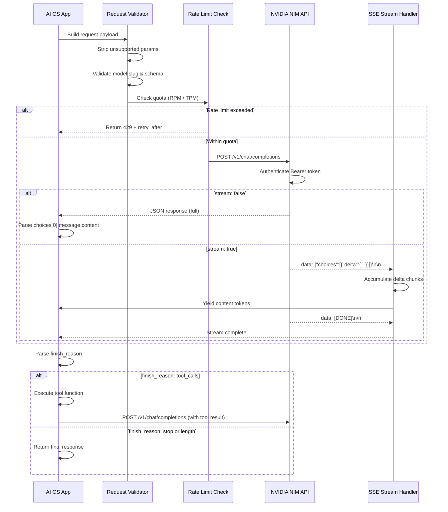

# AI-0002: NVIDIA NIM API Integration Specification

---

## Metadata

| Field | Value |
|-------|-------|
| **Document ID** | AI-0002 |
| **Title** | NVIDIA NIM API Integration Specification |
| **Version** | 1.0.0 |
| **Status** | Active |
| **Owner** | Aldhie |
| **Created** | 2026-07-20 |
| **Updated** | 2026-07-20 |
| **Source** | Official NVIDIA NIM API Documentation + Official NVIDIA API Reference |

---

## Purpose

This document defines how the AI OS connects to NVIDIA Cloud NIM for inference. It covers authentication, endpoint configuration, supported and unsupported request parameters, error catalogue, streaming behavior, thinking/reasoning mode, retry strategy, rate limit management, OpenAI compatibility, and engineering recommendations for production deployment.

---

## Scope

- NIM API authentication and credentials management
- OpenAI-compatible API interface and compatibility matrix
- Supported and unsupported request parameters
- Error codes, error catalogue, and retry strategy
- Streaming (SSE) format and thinking/reasoning mode
- Rate limiting, quota management, and free tier strategy
- Performance guidance and production deployment patterns
- Engineering recommendations

---

## Dependencies

- `AI-0001-Nemotron-Engineering-Spec.md` — model specification and capabilities
- `AI-0005-FreeTier-Strategy.md` — quota and cost management
- `configs/openwebui/parameters.json` — runtime parameter configuration

---

## References

- [NVIDIA NIM API Reference — Nemotron Super 49B](https://docs.api.nvidia.com/nim/reference/nvidia-llama-3_3-nemotron-super-49b-v1)
- [NVIDIA NIM API Reference — Nemotron Ultra 550B](https://docs.api.nvidia.com/nim/reference/nvidia-nemotron-3-ultra-550b-a55b)
- [NVIDIA Build Platform](https://build.nvidia.com/)
- [OpenAI API Compatibility](https://platform.openai.com/docs/api-reference)
- [NVIDIA Open Model License](https://www.nvidia.com/en-us/research/inquiries/)

---

## 1. API Configuration

### 1.1 Base URL

```
https://integrate.api.nvidia.com/v1
```

### 1.2 Authentication

```http
Authorization: Bearer <NVIDIA_API_KEY>
Content-Type: application/json
```

> **Security Note:** Never commit API keys to this repository. Store credentials in environment variables (`NVIDIA_API_KEY`) or a secret manager (Vault, AWS Secrets Manager, etc.).

**Authentication Error Codes:**

| Scenario | HTTP Code | NIM Error | Resolution |
|----------|-----------|-----------|------------|
| Missing header | 401 | `authentication_error` | Add `Authorization: Bearer <key>` |
| Invalid key | 401 | `invalid_api_key` | Verify key on build.nvidia.com |
| Expired key | 401 | `expired_api_key` | Regenerate key on dashboard |
| Wrong format | 400 | `malformed_auth` | Ensure `Bearer ` prefix is present |

### 1.3 Primary Endpoints

| Endpoint | Method | Description |
|----------|--------|-------------|
| `/chat/completions` | POST | Chat completions (OpenAI-compatible) |
| `/models` | GET | List available models |

---

## 2. Supported Models

| Model Slug | Context | Reasoning | Tool Calling | Status |
|---|---|---|---|---|
| `nvidia/llama-3.3-nemotron-super-49b-v1` | 128K tokens | ✅ ON/OFF | ✅ | Production |
| `nvidia/nemotron-3-ultra-550b-a55b` | 1M tokens | ✅ ON/OFF | ✅ | Production |

---

## 3. API Parameter Matrix

### 3.1 Supported Parameters

| Parameter | Type | Default | Range / Values | Notes |
|-----------|------|---------|----------------|-------|
| `model` | string | required | See model slugs above | Must match exact model ID |
| `messages` | array | required | `[{role, content}]` | roles: `system`, `user`, `assistant`, `tool` |
| `temperature` | float | 1.0 | `0.0 – 2.0` | Reasoning ON: use `0.6`; Reasoning OFF: use `0.0` (greedy) |
| `top_p` | float | 1.0 | `0.0 – 1.0` | Reasoning ON: use `0.95` |
| `max_tokens` | integer | model default | `1 – 131072` (Super 49B), `1 – 1048576` (Ultra 550B) | Hard cap on output tokens |
| `stream` | boolean | false | `true` / `false` | SSE streaming; see Section 6 |
| `stop` | string / array | null | Up to 4 stop sequences | Halts generation at matching token |
| `n` | integer | 1 | `1` | Only `n=1` is supported on NIM cloud |
| `tools` | array | null | OpenAI function schema | Enables function/tool calling |
| `tool_choice` | string / object | `auto` | `auto`, `none`, `required`, `{type: function, function: {name}}` | Controls tool selection behavior |
| `frequency_penalty` | float | 0.0 | `-2.0 – 2.0` | Reduces repetition by penalizing frequent tokens |
| `presence_penalty` | float | 0.0 | `-2.0 – 2.0` | Encourages new topics |
| `seed` | integer | null | Any integer | Enables deterministic outputs (best-effort) |
| `logprobs` | boolean | false | `true` / `false` | Returns log probabilities |
| `top_logprobs` | integer | null | `0 – 20` | Requires `logprobs: true` |
| `response_format` | object | null | `{type: "json_object"}` or `{type: "text"}` | JSON mode forces valid JSON output |
| `extra_body` | object | null | `{chat_template_kwargs: {...}}` | NIM-specific extension; see Thinking section |

### 3.2 Unsupported / Ignored Parameters

The following parameters from the OpenAI API are **not supported** on NVIDIA NIM Cloud and will be silently ignored or return an error:

| Parameter | OpenAI Support | NIM Cloud Status | Notes |
|-----------|---------------|-----------------|-------|
| `n > 1` | ✅ | ❌ Not supported | Only single completions; use multiple requests |
| `logit_bias` | ✅ | ❌ Not supported | Token bias manipulation not available |
| `user` | ✅ | ⚠️ Accepted but ignored | User tracking not applied on NIM |
| `suffix` | ✅ (completions) | ❌ Not supported | Legacy completions API field |
| `best_of` | ✅ (legacy) | ❌ Not supported | Legacy API field |
| `echo` | ✅ (legacy) | ❌ Not supported | Legacy API field |
| `stream_options` | ✅ | ⚠️ Partial | `include_usage` may not work on all endpoints |
| `parallel_tool_calls` | ✅ | ⚠️ Model-dependent | Behavior varies by model |
| `modalities` | ✅ (GPT-4o) | ❌ Not supported | Audio/image modalities not on NIM text models |
| `audio` | ✅ (GPT-4o) | ❌ Not supported | Audio output not supported |
| `prediction` | ✅ | ❌ Not supported | Predicted outputs feature not on NIM |
| `store` | ✅ | ❌ Not supported | Conversation storage not on NIM |
| `metadata` | ✅ | ❌ Not supported | Request metadata not on NIM |
| `reasoning_effort` | ✅ (o-series) | ❌ Not supported | Use `extra_body.chat_template_kwargs.enable_thinking` instead |

> **Engineering Note:** Always strip unsupported parameters before sending to NIM. Passing `n > 1` will return a `400` error; others may silently be dropped.

---

## 4. OpenAI Compatibility Matrix

### 4.1 Chat Completions API (`/v1/chat/completions`)

| Feature | OpenAI | NVIDIA NIM | Notes |
|---------|--------|------------|-------|
| Basic chat completion | ✅ | ✅ | Full parity |
| System prompt | ✅ | ✅ | Full parity |
| Multi-turn conversation | ✅ | ✅ | Full parity |
| Streaming (SSE) | ✅ | ✅ | `stream: true` |
| Function/Tool calling | ✅ | ✅ | JSON schema format |
| Parallel tool calls | ✅ | ⚠️ | Model-dependent; test per model |
| JSON mode (`response_format`) | ✅ | ✅ | `{type: "json_object"}` |
| Logprobs | ✅ | ✅ | `logprobs: true` |
| Seed (deterministic) | ✅ | ✅ | Best-effort |
| Multiple completions (`n > 1`) | ✅ | ❌ | Not supported |
| Logit bias | ✅ | ❌ | Not supported |
| Vision (image input) | ✅ (GPT-4V) | ❌ | Text-only models |
| Structured outputs (JSON Schema) | ✅ | ⚠️ | Use `json_object` mode + prompt engineering |
| Usage in streaming | ✅ | ⚠️ | Not guaranteed in all chunks |
| `finish_reason: length` | ✅ | ✅ | When `max_tokens` hit |
| `finish_reason: tool_calls` | ✅ | ✅ | When tool call triggered |
| `finish_reason: stop` | ✅ | ✅ | Normal completion |

### 4.2 Responses API (OpenAI v2 — `/v1/responses`)

| Feature | OpenAI Responses API | NVIDIA NIM Status | Notes |
|---------|---------------------|-------------------|-------|
| Stateful conversations | ✅ | ❌ Not supported | NIM is stateless; manage state client-side |
| Built-in tools (web search) | ✅ | ❌ Not supported | NVIDIA NIM does not provide built-in tools |
| File search tool | ✅ | ❌ Not supported | Implement RAG separately |
| Code interpreter | ✅ | ❌ Not supported | External execution environment required |
| `previous_response_id` | ✅ | ❌ Not supported | No server-side session management |
| Streaming events | ✅ (typed events) | ❌ Not supported | NIM uses standard SSE chunks |
| **Recommendation** | — | Use `/v1/chat/completions` with client-side state management | — |

### 4.3 Tool Calling Compatibility

| Feature | OpenAI | NVIDIA NIM | Notes |
|---------|--------|------------|-------|
| Function definition (JSON Schema) | ✅ | ✅ | Full parity |
| `tool_choice: auto` | ✅ | ✅ | Model decides |
| `tool_choice: none` | ✅ | ✅ | Disables tool calling |
| `tool_choice: required` | ✅ | ✅ | Forces tool call |
| `tool_choice: specific function` | ✅ | ✅ | `{type: "function", function: {name: "..."}}`  |
| Multiple tools in one request | ✅ | ✅ | Pass array in `tools` |
| Parallel tool calls | ✅ | ⚠️ | Test per model; may vary |
| Tool result injection (`role: tool`) | ✅ | ✅ | Full parity |
| Streaming tool call deltas | ✅ | ✅ | Accumulate `delta.tool_calls` chunks |
| Nested tool schemas | ✅ | ⚠️ | Keep schemas flat for best compatibility |

---

## 5. Request Lifecycle



---

## 6. Streaming (SSE)

NVIDIA NIM uses **Server-Sent Events (SSE)** format, identical to OpenAI streaming.

### 6.1 Request

```json
{
  "model": "nvidia/llama-3.3-nemotron-super-49b-v1",
  "messages": [{"role": "user", "content": "Hello"}],
  "stream": true,
  "max_tokens": 512
}
```

### 6.2 SSE Response Format

Each chunk is prefixed with `data: ` followed by a JSON object, terminated with `\n\n`:

```
data: {"id":"chatcmpl-abc","object":"chat.completion.chunk","created":1700000000,"model":"nvidia/llama-3.3-nemotron-super-49b-v1","choices":[{"index":0,"delta":{"role":"assistant","content":""},"finish_reason":null}]}

data: {"id":"chatcmpl-abc","object":"chat.completion.chunk","created":1700000000,"model":"nvidia/llama-3.3-nemotron-super-49b-v1","choices":[{"index":0,"delta":{"content":"Hello"},"finish_reason":null}]}

data: {"id":"chatcmpl-abc","object":"chat.completion.chunk","created":1700000000,"model":"nvidia/llama-3.3-nemotron-super-49b-v1","choices":[{"index":0,"delta":{},"finish_reason":"stop"}]}

data: [DONE]
```

### 6.3 Streaming Implementation Pattern

```python
import httpx

def stream_nim_response(payload: dict, api_key: str):
    headers = {
        "Authorization": f"Bearer {api_key}",
        "Content-Type": "application/json",
        "Accept": "text/event-stream",
    }
    with httpx.Client() as client:
        with client.stream("POST", "https://integrate.api.nvidia.com/v1/chat/completions",
                           json=payload, headers=headers, timeout=120) as response:
            response.raise_for_status()
            for line in response.iter_lines():
                if line.startswith("data: "):
                    data = line[6:]
                    if data == "[DONE]":
                        break
                    chunk = json.loads(data)
                    delta = chunk["choices"][0]["delta"]
                    if content := delta.get("content"):
                        yield content
```

### 6.4 Streaming with Tool Calls

When streaming tool calls, accumulate `delta.tool_calls` across chunks:

```python
tool_calls_accumulator = {}
for line in stream:
    delta = parse_delta(line)
    if delta.get("tool_calls"):
        for tc in delta["tool_calls"]:
            idx = tc["index"]
            if idx not in tool_calls_accumulator:
                tool_calls_accumulator[idx] = {"id": tc["id"], "function": {"name": tc["function"]["name"], "arguments": ""}}
            tool_calls_accumulator[idx]["function"]["arguments"] += tc["function"].get("arguments", "")
```

---

## 7. Thinking / Reasoning Mode

Both Nemotron Super 49B and Ultra 550B support configurable reasoning mode via `extra_body.chat_template_kwargs`.

### 7.1 Thinking Mode Control

| Mode | `enable_thinking` | `temperature` | `top_p` | Use Case |
|------|-------------------|---------------|---------|----------|
| Reasoning ON (full) | `true` | `0.6` | `0.95` | Math, code, complex reasoning |
| Reasoning ON (medium) | `true` + `medium_effort: true` | `0.6` | `0.95` | Balanced quality/cost |
| Reasoning OFF | `false` | `0.0` (greedy) | — | Fast chat, RAG retrieval, simple tasks |

### 7.2 Reasoning ON Request

```json
{
  "model": "nvidia/llama-3.3-nemotron-super-49b-v1",
  "messages": [
    {
      "role": "system",
      "content": "detailed thinking on"
    },
    {
      "role": "user",
      "content": "Solve: If x^2 + 5x + 6 = 0, find x."
    }
  ],
  "temperature": 0.6,
  "top_p": 0.95,
  "max_tokens": 8192,
  "stream": true,
  "extra_body": {
    "chat_template_kwargs": {
      "enable_thinking": true
    }
  }
}
```

> **Note:** For Nemotron Super 49B, reasoning mode is controlled via the **system prompt** (`"detailed thinking on"` / `"detailed thinking off"`). For Nemotron Ultra 550B, use `extra_body.chat_template_kwargs.enable_thinking`.

### 7.3 Reasoning OFF Request

```json
{
  "model": "nvidia/llama-3.3-nemotron-super-49b-v1",
  "messages": [
    {
      "role": "system",
      "content": "detailed thinking off"
    },
    {
      "role": "user",
      "content": "What is the capital of France?"
    }
  ],
  "temperature": 0.0,
  "max_tokens": 512,
  "stream": false
}
```

### 7.4 Thinking Token Budget (Ultra 550B)

Set a hard token ceiling on the reasoning trace using `reasoning_budget` in `extra_body`:

```json
{
  "extra_body": {
    "chat_template_kwargs": {
      "enable_thinking": true,
      "reasoning_budget": 1024
    }
  }
}
```

> The model closes the reasoning trace (`</think>`) at the next newline before the budget is hit. If none is found within 500 tokens, it closes abruptly at `reasoning_budget + 500`.

### 7.5 Reasoning Response Structure

```json
{
  "choices": [
    {
      "message": {
        "role": "assistant",
        "content": "<think>\n...reasoning trace...\n</think>\n\nFinal answer: x = -2 or x = -3"
      },
      "finish_reason": "stop"
    }
  ]
}
```

To extract reasoning vs. final response:

```python
import re

def parse_thinking_response(content: str) -> dict:
    think_match = re.search(r"<think>(.*?)</think>", content, re.DOTALL)
    reasoning = think_match.group(1).strip() if think_match else ""
    final = re.sub(r"<think>.*?</think>\s*", "", content, flags=re.DOTALL).strip()
    return {"reasoning": reasoning, "response": final}
```

---

## 8. Error Catalogue

### 8.1 HTTP Error Codes

| HTTP Code | Category | NIM Error Message | Root Cause | Recommended Action |
|-----------|----------|-------------------|------------|-------------------|
| `400` | Bad Request | `invalid_request_error` | Malformed JSON, invalid schema, unsupported param (`n>1`) | Validate payload; strip unsupported params |
| `401` | Unauthorized | `authentication_error` | Missing/invalid/expired API key | Check `Authorization` header; regenerate key if expired |
| `403` | Forbidden | `permission_denied` | API key lacks access to model or region | Verify key permissions on build.nvidia.com |
| `404` | Not Found | `model_not_found` | Invalid model slug | Check exact model ID from `/v1/models` |
| `422` | Unprocessable | `validation_error` | Parameter values out of range | Check `temperature`, `top_p`, `max_tokens` ranges |
| `429` | Rate Limited | `rate_limit_error` | RPM or TPM quota exceeded | Read `retry-after` header; apply exponential backoff |
| `500` | Server Error | `internal_server_error` | NIM infrastructure issue | Retry with exponential backoff; alert if persistent |
| `502` | Bad Gateway | `bad_gateway` | Upstream NIM node failure | Retry after short delay |
| `503` | Unavailable | `service_unavailable` | NIM capacity exhausted or maintenance | Retry with backoff; check NVIDIA status page |
| `504` | Timeout | `gateway_timeout` | Request took too long | Reduce `max_tokens`; retry; check for long context issues |

### 8.2 Application-Level Error Patterns

| Symptom | Likely Cause | Debug Steps |
|---------|-------------|-------------|
| Empty `content` in response | `finish_reason: length` hit | Increase `max_tokens` or reduce prompt |
| Tool call not triggered | Tools not in model context | Verify tool schema is valid JSON Schema |
| Thinking trace missing | Wrong system prompt for Super 49B | Use `"detailed thinking on"` in system role |
| Response cuts off mid-sentence | `max_tokens` too low | Calculate token budget before request |
| 401 on valid key | Clock skew or key rotation | Check system time; verify key on dashboard |

---

## 9. Retry Strategy

### 9.1 Retry Matrix

| Error Code | Retryable | Initial Wait | Max Attempts | Strategy |
|------------|-----------|-------------|--------------|----------|
| `429` | ✅ Yes | `retry-after` header value | 5 | Respect `retry-after`; then exponential + jitter |
| `500` | ✅ Yes | 1s | 4 | Exponential backoff with jitter |
| `502` | ✅ Yes | 2s | 3 | Exponential backoff |
| `503` | ✅ Yes | 5s | 4 | Exponential backoff |
| `504` | ✅ Yes | 3s | 3 | Exponential backoff; reduce payload if possible |
| `400` | ❌ No | — | 0 | Fix request payload; do not retry |
| `401` | ❌ No | — | 0 | Fix authentication; do not retry |
| `403` | ❌ No | — | 0 | Fix permissions; do not retry |
| `404` | ❌ No | — | 0 | Fix model slug; do not retry |
| `422` | ❌ No | — | 0 | Fix parameter values; do not retry |

### 9.2 Exponential Backoff with Jitter (Reference Implementation)

```python
import asyncio
import random
import httpx
from typing import Any

RETRYABLE_CODES = {429, 500, 502, 503, 504}
NON_RETRYABLE_CODES = {400, 401, 403, 404, 422}

async def nim_request_with_retry(
    payload: dict,
    api_key: str,
    max_attempts: int = 5,
    base_delay: float = 1.0,
    max_delay: float = 60.0,
) -> dict:
    """
    Async NIM request with exponential backoff + full jitter.
    Full jitter formula: sleep = random(0, min(cap, base * 2^attempt))
    """
    url = "https://integrate.api.nvidia.com/v1/chat/completions"
    headers = {
        "Authorization": f"Bearer {api_key}",
        "Content-Type": "application/json",
    }

    async with httpx.AsyncClient(timeout=120.0) as client:
        for attempt in range(max_attempts):
            try:
                response = await client.post(url, json=payload, headers=headers)

                if response.status_code == 200:
                    return response.json()

                if response.status_code in NON_RETRYABLE_CODES:
                    raise ValueError(f"Non-retryable error {response.status_code}: {response.text}")

                if response.status_code in RETRYABLE_CODES:
                    if attempt == max_attempts - 1:
                        raise RuntimeError(f"Max retries exceeded. Last status: {response.status_code}")

                    # Respect retry-after header for 429
                    retry_after = float(response.headers.get("retry-after", 0))
                    
                    # Full jitter: sleep = random(0, min(max_delay, base * 2^attempt))
                    cap = min(max_delay, base_delay * (2 ** attempt))
                    jitter_delay = random.uniform(0, cap)
                    
                    wait = max(retry_after, jitter_delay)
                    await asyncio.sleep(wait)
                    continue

            except httpx.TimeoutException:
                if attempt == max_attempts - 1:
                    raise
                await asyncio.sleep(base_delay * (2 ** attempt))

    raise RuntimeError("Unexpected retry loop exit")
```

### 9.3 Circuit Breaker Pattern

For production systems, wrap the retry logic with a circuit breaker to prevent cascading failures:

```
States: CLOSED → OPEN → HALF-OPEN → CLOSED

CLOSED:    Normal operation. Track failure rate.
           If failure rate > 50% in 60s window → OPEN

OPEN:      Reject all requests immediately (fail fast).
           After 30s cooldown → HALF-OPEN

HALF-OPEN: Allow 1 probe request.
           Success → CLOSED | Failure → OPEN
```

---

## 10. Rate Limits

### 10.1 Free Tier Limits

| Resource | Limit | Notes |
|----------|-------|-------|
| Requests per minute (RPM) | ~40 RPM | Approximate; varies by model |
| Tokens per minute (TPM) | ~40,000 TPM | Input + output tokens combined |
| Daily credit | $0.00 credit allotment | Limited free API credits on build.nvidia.com |
| Concurrent requests | Limited | Single-digit concurrent requests on free tier |

> **Note:** NVIDIA free tier limits are not publicly documented with exact values. Always instrument your application to handle `429` responses and parse the `retry-after` header.

### 10.2 Production / Paid Tier

| Resource | Limit | Notes |
|----------|-------|-------|
| RPM | Higher; negotiated | Based on subscription tier |
| TPM | Higher; negotiated | Scales with pricing plan |
| Context window billing | Per token (input + output) | See build.nvidia.com pricing |
| Concurrent requests | Higher concurrency | Enterprise plans available |

### 10.3 Rate Limit Response Headers

```http
HTTP/1.1 429 Too Many Requests
retry-after: 30
x-ratelimit-limit-requests: 40
x-ratelimit-remaining-requests: 0
x-ratelimit-reset-requests: 2026-07-20T16:10:00Z
```

### 10.4 Token Budget Estimation

```python
# Rough estimation before sending request
# Use tiktoken (cl100k_base) as approximation for Nemotron tokenizer
import tiktoken

def estimate_tokens(messages: list, model_overhead: int = 4) -> int:
    enc = tiktoken.get_encoding("cl100k_base")
    total = 0
    for msg in messages:
        total += model_overhead  # per-message overhead
        total += len(enc.encode(msg.get("content", "")))
    return total + 2  # reply priming tokens

def check_context_budget(messages: list, max_tokens_response: int, model_limit: int = 128000) -> bool:
    prompt_tokens = estimate_tokens(messages)
    total = prompt_tokens + max_tokens_response
    return total <= model_limit
```

---

## 11. Performance Guidance

### 11.1 Latency vs. Throughput Trade-offs

| Configuration | TTFT | Throughput | Cost | Use Case |
|---------------|------|------------|------|----------|
| Streaming ON, small `max_tokens` | Low | Medium | Low | Chat, interactive |
| Streaming OFF, large `max_tokens` | High | High | Medium | Batch, document analysis |
| Reasoning ON, large `max_tokens` | High | Low | High | Math, code, deep analysis |
| Reasoning OFF, greedy (`temp=0`) | Low | High | Low | RAG retrieval, classification |

### 11.2 Context Management Best Practices

- **Trim conversation history** to the last N messages when context approaches the model limit.
- **Use summarization** for long conversations: periodically compress older turns into a summary message.
- **Separate system prompt** from conversation history; system prompt counts toward context.
- **Reasoning traces** (`<think>...</think>`) consume tokens — factor into `max_tokens` budget.

### 11.3 Throughput Optimization for Free Tier

```python
import asyncio
from collections import deque
import time

class TokenBucketRateLimiter:
    """Token bucket rate limiter for NIM API calls."""
    
    def __init__(self, rpm_limit: int = 35, tpm_limit: int = 35000):
        self.rpm_limit = rpm_limit
        self.tpm_limit = tpm_limit
        self.request_times: deque = deque()
        self.token_times: deque = deque()
        self._lock = asyncio.Lock()
    
    async def acquire(self, estimated_tokens: int = 1000):
        async with self._lock:
            now = time.time()
            window = 60.0
            
            # Clean old entries
            while self.request_times and now - self.request_times[0] > window:
                self.request_times.popleft()
            while self.token_times and now - self.token_times[0][0] > window:
                self.token_times.popleft()
            
            current_rpm = len(self.request_times)
            current_tpm = sum(t for _, t in self.token_times)
            
            if current_rpm >= self.rpm_limit or current_tpm + estimated_tokens > self.tpm_limit:
                # Wait until oldest entry expires
                wait_until = self.request_times[0] + window if self.request_times else now
                await asyncio.sleep(max(0, wait_until - now + 0.1))
            
            self.request_times.append(time.time())
            self.token_times.append((time.time(), estimated_tokens))
```

---

## 12. Engineering Recommendations

### 12.1 Authentication

| Recommendation | Priority | Implementation |
|----------------|----------|----------------|
| Store API key in environment variable | 🔴 Critical | `os.environ["NVIDIA_API_KEY"]` |
| Rotate keys every 90 days | 🟡 High | Calendar reminder + CI/CD pipeline |
| Use separate keys for dev/staging/prod | 🟡 High | Three keys on build.nvidia.com |
| Never log the full API key | 🔴 Critical | Mask to last 4 chars in logs |
| Validate key format before requests | 🟢 Medium | Regex check for `nvapi-` prefix |

### 12.2 Request Architecture

| Recommendation | Priority | Rationale |
|----------------|----------|-----------|
| Always use `stream: true` for user-facing responses | 🟡 High | Dramatically improves perceived latency |
| Strip unsupported parameters in a middleware layer | 🟡 High | Prevents unexpected 400 errors |
| Set `max_tokens` explicitly; never rely on defaults | 🟡 High | Prevents runaway token usage on free tier |
| Use `temperature: 0.0` for deterministic tasks (RAG, classification) | 🟢 Medium | Consistent, reproducible outputs |
| Use `temperature: 0.6, top_p: 0.95` for reasoning tasks | 🟡 High | NVIDIA recommended settings |
| Validate JSON schema before tool call injection | 🟢 Medium | Prevents tool parsing failures |

### 12.3 Error Handling

| Recommendation | Priority | Rationale |
|----------------|----------|-----------|
| Implement circuit breaker around NIM calls | 🟡 High | Prevents cascading failures during NIM outages |
| Parse `retry-after` header on all 429 responses | 🔴 Critical | Avoid hammering rate limits |
| Log `request_id` from response headers | 🟢 Medium | Enables NVIDIA support debugging |
| Set client-side timeout of 120s | 🟡 High | Streaming responses can be long |
| Distinguish retryable vs. non-retryable errors | 🔴 Critical | Do not retry 400/401/403/404 |

### 12.4 Free Tier Optimization

| Recommendation | Priority | Rationale |
|----------------|----------|-----------|
| Cache identical requests (semantic or exact hash) | 🟡 High | Reduce RPM/TPM consumption |
| Use Reasoning OFF for non-reasoning tasks | 🟡 High | Fewer tokens = lower cost |
| Batch non-urgent requests with queue + rate limiter | 🟢 Medium | Stay within RPM limits |
| Monitor daily token consumption | 🟡 High | Avoid unexpected exhaustion |
| Use Nemotron Super 49B for most tasks (vs Ultra 550B) | 🟢 Medium | Lower token cost; sufficient for most use cases |

### 12.5 Production Deployment Checklist

```
Pre-Deployment:
[ ] API key stored in secret manager (not .env file in repo)
[ ] Retry logic implemented with exponential backoff + jitter
[ ] Circuit breaker configured (failure threshold: 50%, cooldown: 30s)
[ ] Client-side timeout set (120s for streaming, 60s for non-streaming)
[ ] Unsupported parameter stripping middleware in place
[ ] Token budget estimator validates requests before sending
[ ] Rate limiter configured (RPM and TPM tracking)

Monitoring:
[ ] Log 429 rate and retry-after values
[ ] Alert on >5% error rate over 5-minute window
[ ] Track p50/p95/p99 TTFT (time-to-first-token)
[ ] Monitor total token consumption (input + output)
[ ] Health check endpoint pings /v1/models every 60s

Post-Deployment:
[ ] Verify streaming works end-to-end in production
[ ] Validate tool calling with real payloads
[ ] Confirm reasoning ON/OFF toggle works correctly
[ ] Test circuit breaker by simulating 429 storm
```

---

## 13. Open WebUI Integration

Open WebUI connects to NIM via its **OpenAI-compatible API** configuration:

1. Navigate to **Settings → Connections → OpenAI API**
2. Add new connection:
   - **Base URL:** `https://integrate.api.nvidia.com/v1`
   - **API Key:** `<NVIDIA_API_KEY>`
3. Select model: `nvidia/llama-3.3-nemotron-super-49b-v1`
4. In model parameters, set:
   - **Temperature:** `0.6` (Reasoning ON) or `0.0` (Reasoning OFF)
   - **Top P:** `0.95`
   - **Max Tokens:** `4096` (default; increase for longer tasks)
5. For Reasoning ON, add system prompt: `detailed thinking on`

> **Limitation:** Open WebUI does not natively support `extra_body.chat_template_kwargs`. For Nemotron Super 49B, use the system prompt method to toggle reasoning mode.

---

## Changelog

| Version | Date | Changes |
|---------|------|---------|
| 0.1.0 | 2026-07-20 | Initial draft |
| 1.0.0 | 2026-07-20 | Complete specification: parameter matrix, compatibility matrix, request lifecycle, retry strategy, error catalogue, streaming, thinking mode, rate limits, engineering recommendations |
